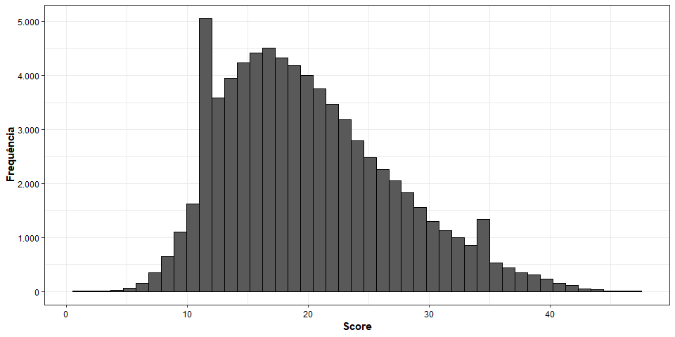
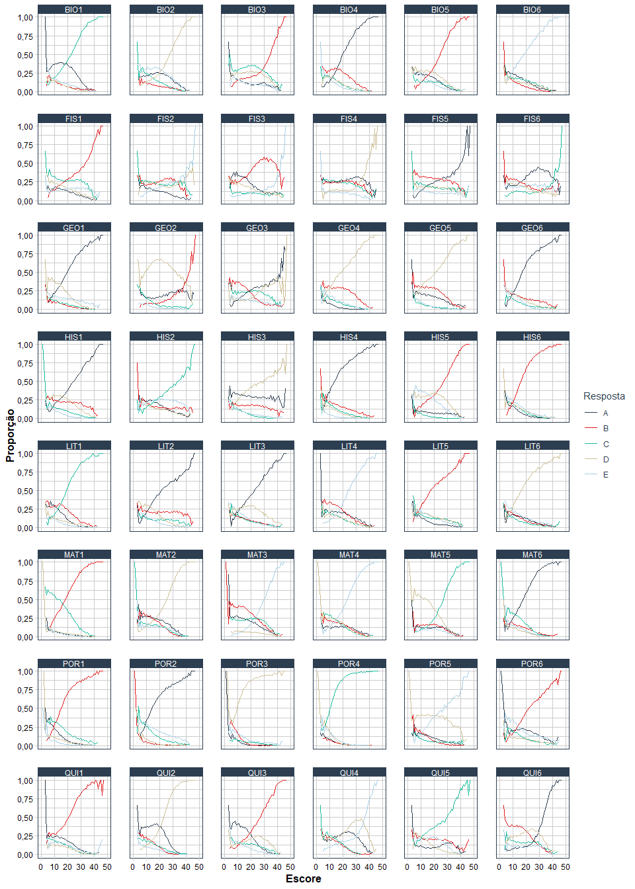
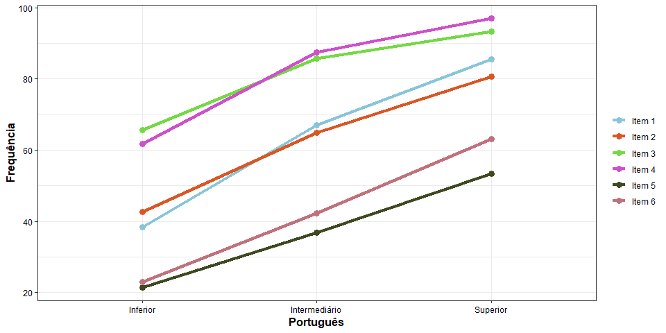
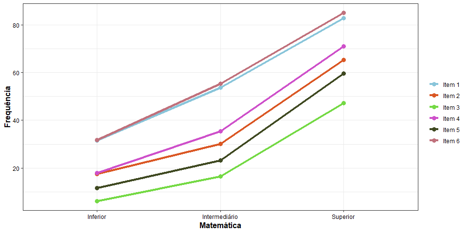
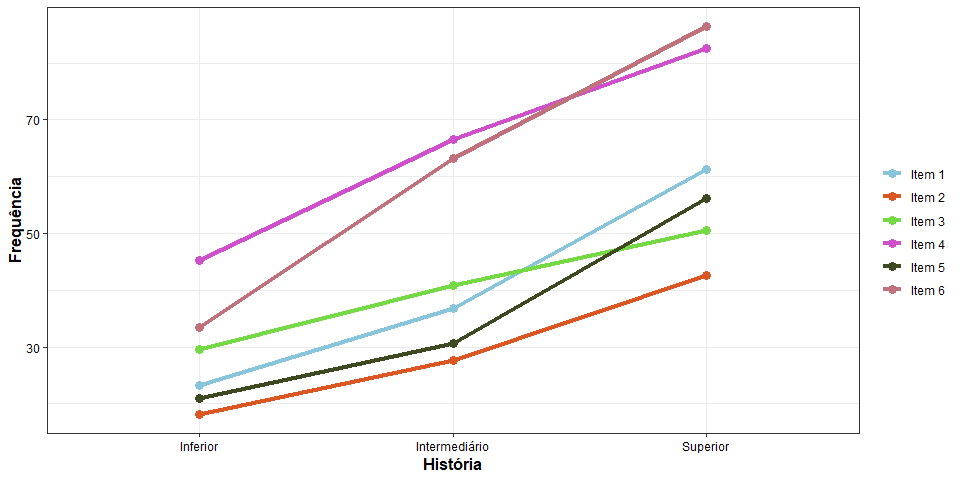
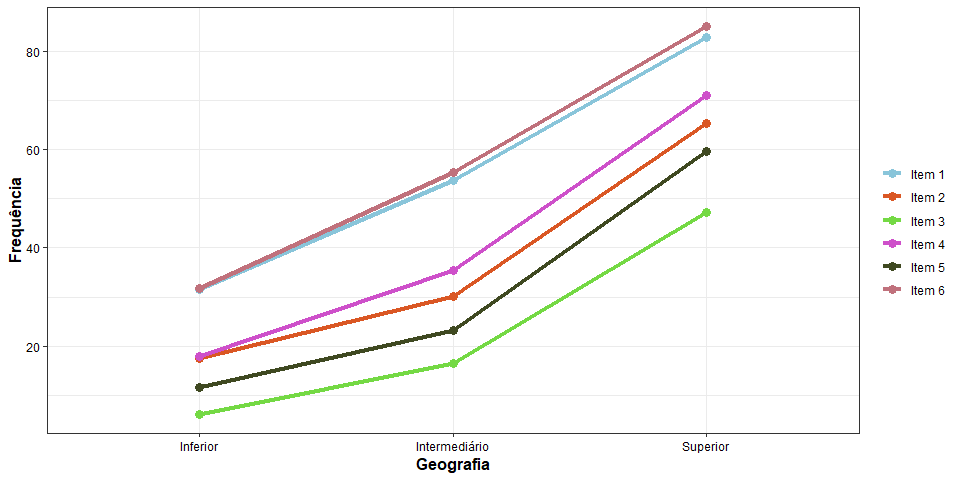
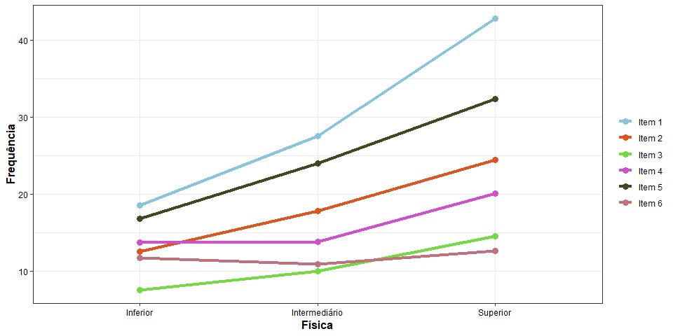
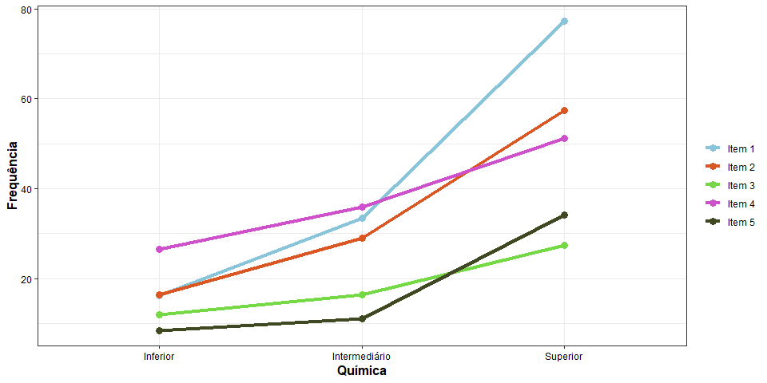
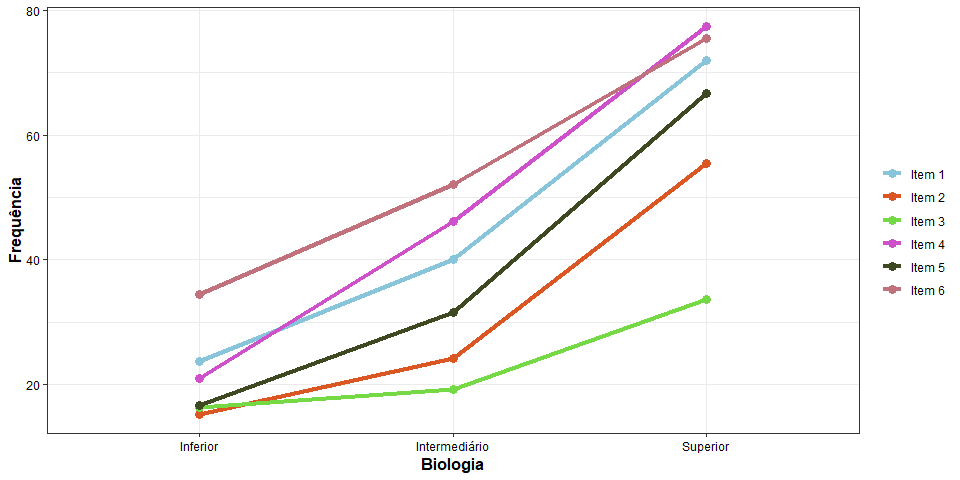
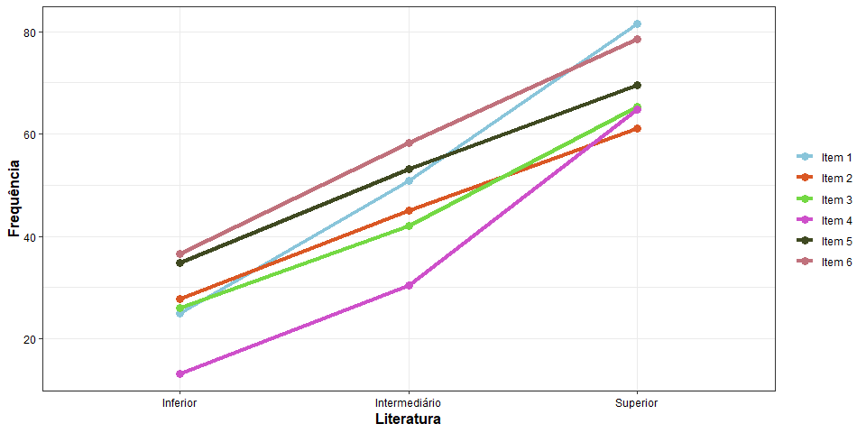

Tarefa 1
================
Rafael Barbosa da Silva
11/05/2019

## Limpando o banco

``` r
rm(list = ls())
```

## Carregando os pacotes necessários

``` r
if(!require(tidyverse)) {
  install.packages("tidyverse", dependencies = T); 
  require(tidyverse)
}


if(!require(magrittr)) {
  install.packages("magrittr", dependencies = T); 
  require(magrittr)
}


if(!require(data.table)) {
  install.packages("data.table", dependencies = T); 
  require(data.table)
}


if(!require(tidyquant)) {
  install.packages("tidyquant", dependencies = T); 
  require(tidyquant)
}


if(!require(pander)) {
  install.packages("pander", dependencies = T); 
  require(pander)
}
```

## Funções adicionais

``` r
formato_real <- function(values, nsmall = 0) { #- Formatando o valor como moeda brasileira
  values %>%
    as.numeric() %>%
    format(nsmall = nsmall, decimal.mark = ",", big.mark = ".") %>%
    str_trim() %>%
    str_c("R$ ", .)
}

formato_real_graf <- function(values, nsmall = 0) { #- Formatando o valor como moeda 
  values %>%
    as.numeric() %>%
    format(nsmall = nsmall, decimal.mark = ",", big.mark = ".") %>%
    str_trim()
}
```

## Carregando as respostas e o gabarito

``` r
respostas <- fread(file = "Base1.txt", header = T, fill = T, na.strings = "")


gabarito <- fread(file = "Gab1.txt", header = T)
```

## Manipulação no banco

``` r
respostas %<>%
  filter_all(any_vars(!str_detect(., pattern = "---"))) %>%  # Desconsiderar as linhas "---"
  filter(Lingua != "", Lingua != "(73391") %>% # Retiras as ultimas linhas: " " e "(73391 rows...)
  mutate_all(as.factor) %>% # Colocando todas as colunas como fatores
  mutate_all(str_replace_all, fixed("*"), NA) %>% # Mudar o que tiver de * para NA 
  mutate_all(list(~ replace_na(., 0))) %>% # Mudar o NA para 0
  select(-matches("^LIN")) %>% # Remove a lingua estrangeira
  select(-c(Origem, Inst, Isento)) # Remover as colunas


gabarito %<>%
  select_at(vars(-ends_with("49"), -ends_with("50"), -ends_with("51"),
                 -ends_with("52"), -ends_with("53"), -ends_with("54"))) %>%
  select(-c(Gab_codigo, Lin_codigo)) %>%
  set_colnames(colnames(respostas)) %>%
  distinct
```

## Questão 1

``` r
quest1 <-
  respostas %>%
  gather() %>%
  group_by(key, value) %>%
  summarise(count = n()) %>%
  mutate(perc = round(x = count/sum(count)*100, digits = 2)) %>%
  rename(Resposta = value, Frequencia = count, Percentual = perc) %>%
  split(.$key)

quest1 %>% 
  pander()
```

  - **BIO1**:
    
    | key  | Resposta | Frequencia | Percentual |
    | :--: | :------: | :--------: | :--------: |
    | BIO1 |    0     |     81     |    0.11    |
    | BIO1 |    A     |   22914    |   31.22    |
    | BIO1 |    B     |    5343    |    7.28    |
    | BIO1 |    C     |   32619    |   44.45    |
    | BIO1 |    D     |    5145    |    7.01    |
    | BIO1 |    E     |    7289    |    9.93    |
    

  - **BIO2**:
    
    | key  | Resposta | Frequencia | Percentual |
    | :--: | :------: | :--------: | :--------: |
    | BIO2 |    0     |    145     |    0.2     |
    | BIO2 |    A     |   15760    |   21.47    |
    | BIO2 |    B     |    5435    |    7.41    |
    | BIO2 |    C     |    9856    |   13.43    |
    | BIO2 |    D     |   22391    |   30.51    |
    | BIO2 |    E     |   19804    |   26.98    |
    

  - **BIO3**:
    
    | key  | Resposta | Frequencia | Percentual |
    | :--: | :------: | :--------: | :--------: |
    | BIO3 |    0     |    130     |    0.18    |
    | BIO3 |    A     |    8078    |   11.01    |
    | BIO3 |    B     |   16484    |   22.46    |
    | BIO3 |    C     |   22877    |   31.17    |
    | BIO3 |    D     |   17995    |   24.52    |
    | BIO3 |    E     |    7827    |   10.66    |
    

  - **BIO4**:
    
    | key  | Resposta | Frequencia | Percentual |
    | :--: | :------: | :--------: | :--------: |
    | BIO4 |    0     |    155     |    0.21    |
    | BIO4 |    A     |   35157    |    47.9    |
    | BIO4 |    B     |   17618    |   24.01    |
    | BIO4 |    C     |    7553    |   10.29    |
    | BIO4 |    D     |    7842    |   10.69    |
    | BIO4 |    E     |    5066    |    6.9     |
    

  - **BIO5**:
    
    | key  | Resposta | Frequencia | Percentual |
    | :--: | :------: | :--------: | :--------: |
    | BIO5 |    0     |    184     |    0.25    |
    | BIO5 |    A     |   12258    |    16.7    |
    | BIO5 |    B     |   27331    |   37.24    |
    | BIO5 |    C     |    8634    |   11.76    |
    | BIO5 |    D     |   16548    |   22.55    |
    | BIO5 |    E     |    8436    |   11.49    |
    

  - **BIO6**:
    
    | key  | Resposta | Frequencia | Percentual |
    | :--: | :------: | :--------: | :--------: |
    | BIO6 |    0     |    232     |    0.32    |
    | BIO6 |    A     |   10382    |   14.15    |
    | BIO6 |    B     |    5089    |    6.93    |
    | BIO6 |    C     |   10309    |   14.05    |
    | BIO6 |    D     |    7956    |   10.84    |
    | BIO6 |    E     |   39423    |   53.72    |
    

  - **FIS1**:
    
    | key  | Resposta | Frequencia | Percentual |
    | :--: | :------: | :--------: | :--------: |
    | FIS1 |    0     |     85     |    0.12    |
    | FIS1 |    A     |    8981    |   12.24    |
    | FIS1 |    B     |   21502    |    29.3    |
    | FIS1 |    C     |   19624    |   26.74    |
    | FIS1 |    D     |   12019    |   16.38    |
    | FIS1 |    E     |   11180    |   15.23    |
    

  - **FIS2**:
    
    | key  | Resposta | Frequencia | Percentual |
    | :--: | :------: | :--------: | :--------: |
    | FIS2 |    0     |     87     |    0.12    |
    | FIS2 |    A     |    8937    |   12.18    |
    | FIS2 |    B     |   18043    |   24.58    |
    | FIS2 |    C     |   16772    |   22.85    |
    | FIS2 |    D     |   16197    |   22.07    |
    | FIS2 |    E     |   13355    |    18.2    |
    

  - **FIS3**:
    
    | key  | Resposta | Frequencia | Percentual |
    | :--: | :------: | :--------: | :--------: |
    | FIS3 |    0     |     93     |    0.13    |
    | FIS3 |    A     |   17225    |   23.47    |
    | FIS3 |    B     |   28861    |   39.32    |
    | FIS3 |    C     |    7054    |    9.61    |
    | FIS3 |    D     |   12380    |   16.87    |
    | FIS3 |    E     |    7778    |    10.6    |
    

  - **FIS4**:
    
    | key  | Resposta | Frequencia | Percentual |
    | :--: | :------: | :--------: | :--------: |
    | FIS4 |    0     |    122     |    0.17    |
    | FIS4 |    A     |   19533    |   26.61    |
    | FIS4 |    B     |   17833    |    24.3    |
    | FIS4 |    C     |   17375    |   23.67    |
    | FIS4 |    D     |   11419    |   15.56    |
    | FIS4 |    E     |    7109    |    9.69    |
    

  - **FIS5**:
    
    | key  | Resposta | Frequencia | Percentual |
    | :--: | :------: | :--------: | :--------: |
    | FIS5 |    0     |     86     |    0.12    |
    | FIS5 |    A     |   17853    |   24.33    |
    | FIS5 |    B     |   21662    |   29.52    |
    | FIS5 |    C     |   13209    |     18     |
    | FIS5 |    D     |   12790    |   17.43    |
    | FIS5 |    E     |    7791    |   10.62    |
    

  - **FIS6**:
    
    | key  | Resposta | Frequencia | Percentual |
    | :--: | :------: | :--------: | :--------: |
    | FIS6 |    0     |    121     |    0.16    |
    | FIS6 |    A     |   22395    |   30.51    |
    | FIS6 |    B     |   15639    |   21.31    |
    | FIS6 |    C     |    8510    |    11.6    |
    | FIS6 |    D     |   12593    |   17.16    |
    | FIS6 |    E     |   14133    |   19.26    |
    

  - **GEO1**:
    
    | key  | Resposta | Frequencia | Percentual |
    | :--: | :------: | :--------: | :--------: |
    | GEO1 |    0     |     54     |    0.07    |
    | GEO1 |    A     |   37175    |   50.65    |
    | GEO1 |    B     |    4158    |    5.67    |
    | GEO1 |    C     |    5145    |    7.01    |
    | GEO1 |    D     |   16220    |    22.1    |
    | GEO1 |    E     |   10639    |    14.5    |
    

  - **GEO2**:
    
    | key  | Resposta | Frequencia | Percentual |
    | :--: | :------: | :--------: | :--------: |
    | GEO2 |    0     |    102     |    0.14    |
    | GEO2 |    A     |   13196    |   17.98    |
    | GEO2 |    B     |    8115    |   11.06    |
    | GEO2 |    C     |    5257    |    7.16    |
    | GEO2 |    D     |   44806    |   61.05    |
    | GEO2 |    E     |    1915    |    2.61    |
    

  - **GEO3**:
    
    | key  | Resposta | Frequencia | Percentual |
    | :--: | :------: | :--------: | :--------: |
    | GEO3 |    0     |    143     |    0.19    |
    | GEO3 |    A     |   18227    |   24.84    |
    | GEO3 |    B     |   16411    |   22.36    |
    | GEO3 |    C     |   16902    |   23.03    |
    | GEO3 |    D     |   12891    |   17.56    |
    | GEO3 |    E     |    8817    |   12.01    |
    

  - **GEO4**:
    
    | key  | Resposta | Frequencia | Percentual |
    | :--: | :------: | :--------: | :--------: |
    | GEO4 |    0     |    121     |    0.16    |
    | GEO4 |    A     |    2009    |    2.74    |
    | GEO4 |    B     |   19208    |   26.17    |
    | GEO4 |    C     |    5824    |    7.94    |
    | GEO4 |    D     |   38850    |   52.94    |
    | GEO4 |    E     |    7379    |   10.05    |
    

  - **GEO5**:
    
    | key  | Resposta | Frequencia | Percentual |
    | :--: | :------: | :--------: | :--------: |
    | GEO5 |    0     |    106     |    0.14    |
    | GEO5 |    A     |   12117    |   16.51    |
    | GEO5 |    B     |   18922    |   25.78    |
    | GEO5 |    C     |    2745    |    3.74    |
    | GEO5 |    D     |   36394    |   49.59    |
    | GEO5 |    E     |    3107    |    4.23    |
    

  - **GEO6**:
    
    | key  | Resposta | Frequencia | Percentual |
    | :--: | :------: | :--------: | :--------: |
    | GEO6 |    0     |     78     |    0.11    |
    | GEO6 |    A     |   41259    |   56.22    |
    | GEO6 |    B     |   10996    |   14.98    |
    | GEO6 |    C     |    5233    |    7.13    |
    | GEO6 |    D     |    9240    |   12.59    |
    | GEO6 |    E     |    6585    |    8.97    |
    

  - **HIS1**:
    
    | key  | Resposta | Frequencia | Percentual |
    | :--: | :------: | :--------: | :--------: |
    | HIS1 |    0     |     88     |    0.12    |
    | HIS1 |    A     |   29309    |   39.94    |
    | HIS1 |    B     |   15934    |   21.71    |
    | HIS1 |    C     |    6998    |    9.54    |
    | HIS1 |    D     |   17549    |   23.91    |
    | HIS1 |    E     |    3513    |    4.79    |
    

  - **HIS2**:
    
    | key  | Resposta | Frequencia | Percentual |
    | :--: | :------: | :--------: | :--------: |
    | HIS2 |    0     |    123     |    0.17    |
    | HIS2 |    A     |   13289    |   18.11    |
    | HIS2 |    B     |   11516    |   15.69    |
    | HIS2 |    C     |   21446    |   29.22    |
    | HIS2 |    D     |    9357    |   12.75    |
    | HIS2 |    E     |   17660    |   24.06    |
    

  - **HIS3**:
    
    | key  | Resposta | Frequencia | Percentual |
    | :--: | :------: | :--------: | :--------: |
    | HIS3 |    0     |    144     |    0.2     |
    | HIS3 |    A     |   21906    |   29.85    |
    | HIS3 |    B     |   12537    |   17.08    |
    | HIS3 |    C     |    4210    |    5.74    |
    | HIS3 |    D     |   29635    |   40.38    |
    | HIS3 |    E     |    4959    |    6.76    |
    

  - **HIS4**:
    
    | key  | Resposta | Frequencia | Percentual |
    | :--: | :------: | :--------: | :--------: |
    | HIS4 |    0     |    198     |    0.27    |
    | HIS4 |    A     |   47745    |   65.06    |
    | HIS4 |    B     |   11409    |   15.55    |
    | HIS4 |    C     |    7200    |    9.81    |
    | HIS4 |    D     |    5496    |    7.49    |
    | HIS4 |    E     |    1343    |    1.83    |
    

  - **HIS5**:
    
    | key  | Resposta | Frequencia | Percentual |
    | :--: | :------: | :--------: | :--------: |
    | HIS5 |    0     |    171     |    0.23    |
    | HIS5 |    A     |    5461    |    7.44    |
    | HIS5 |    B     |   25770    |   35.11    |
    | HIS5 |    C     |    1758    |    2.4     |
    | HIS5 |    D     |   21631    |   29.47    |
    | HIS5 |    E     |   18600    |   25.34    |
    

  - **HIS6**:
    
    | key  | Resposta | Frequencia | Percentual |
    | :--: | :------: | :--------: | :--------: |
    | HIS6 |    0     |     64     |    0.09    |
    | HIS6 |    A     |    4677    |    6.37    |
    | HIS6 |    B     |   45041    |   61.37    |
    | HIS6 |    C     |    6774    |    9.23    |
    | HIS6 |    D     |    7679    |   10.46    |
    | HIS6 |    E     |    9156    |   12.48    |
    

  - **LIT1**:
    
    | key  | Resposta | Frequencia | Percentual |
    | :--: | :------: | :--------: | :--------: |
    | LIT1 |    0     |    116     |    0.16    |
    | LIT1 |    A     |    9756    |   13.29    |
    | LIT1 |    B     |   16264    |   22.16    |
    | LIT1 |    C     |   38304    |   52.19    |
    | LIT1 |    D     |    5575    |    7.6     |
    | LIT1 |    E     |    3376    |    4.6     |
    

  - **LIT2**:
    
    | key  | Resposta | Frequencia | Percentual |
    | :--: | :------: | :--------: | :--------: |
    | LIT2 |    0     |    138     |    0.19    |
    | LIT2 |    A     |   32821    |   44.72    |
    | LIT2 |    B     |   15071    |   20.54    |
    | LIT2 |    C     |    7465    |   10.17    |
    | LIT2 |    D     |   12706    |   17.31    |
    | LIT2 |    E     |    5190    |    7.07    |
    

  - **LIT3**:
    
    | key  | Resposta | Frequencia | Percentual |
    | :--: | :------: | :--------: | :--------: |
    | LIT3 |    0     |    184     |    0.25    |
    | LIT3 |    A     |   32330    |   44.05    |
    | LIT3 |    B     |    7032    |    9.58    |
    | LIT3 |    C     |    6745    |    9.19    |
    | LIT3 |    D     |   18754    |   25.55    |
    | LIT3 |    E     |    8346    |   11.37    |
    

  - **LIT4**:
    
    | key  | Resposta | Frequencia | Percentual |
    | :--: | :------: | :--------: | :--------: |
    | LIT4 |    0     |    173     |    0.24    |
    | LIT4 |    A     |   13370    |   18.22    |
    | LIT4 |    B     |   16515    |    22.5    |
    | LIT4 |    C     |    8779    |   11.96    |
    | LIT4 |    D     |    8672    |   11.82    |
    | LIT4 |    E     |   25882    |   35.27    |
    

  - **LIT5**:
    
    | key  | Resposta | Frequencia | Percentual |
    | :--: | :------: | :--------: | :--------: |
    | LIT5 |    0     |    146     |    0.2     |
    | LIT5 |    A     |    4718    |    6.43    |
    | LIT5 |    B     |   38645    |   52.66    |
    | LIT5 |    C     |    9199    |   12.53    |
    | LIT5 |    D     |   10894    |   14.84    |
    | LIT5 |    E     |    9789    |   13.34    |
    

  - **LIT6**:
    
    | key  | Resposta | Frequencia | Percentual |
    | :--: | :------: | :--------: | :--------: |
    | LIT6 |    0     |    173     |    0.24    |
    | LIT6 |    A     |    8512    |    11.6    |
    | LIT6 |    B     |    7521    |   10.25    |
    | LIT6 |    C     |    4987    |    6.8     |
    | LIT6 |    D     |   42493    |    57.9    |
    | LIT6 |    E     |    9705    |   13.22    |
    

  - **MAT1**:
    
    | key  | Resposta | Frequencia | Percentual |
    | :--: | :------: | :--------: | :--------: |
    | MAT1 |    0     |     70     |    0.1     |
    | MAT1 |    A     |    2250    |    3.07    |
    | MAT1 |    B     |   40901    |   55.73    |
    | MAT1 |    C     |   24936    |   33.98    |
    | MAT1 |    D     |    3019    |    4.11    |
    | MAT1 |    E     |    2215    |    3.02    |
    

  - **MAT2**:
    
    | key  | Resposta | Frequencia | Percentual |
    | :--: | :------: | :--------: | :--------: |
    | MAT2 |    0     |    162     |    0.22    |
    | MAT2 |    A     |   15399    |   20.98    |
    | MAT2 |    B     |   12743    |   17.36    |
    | MAT2 |    C     |    9417    |   12.83    |
    | MAT2 |    D     |   26804    |   36.52    |
    | MAT2 |    E     |    8866    |   12.08    |
    

  - **MAT3**:
    
    | key  | Resposta | Frequencia | Percentual |
    | :--: | :------: | :--------: | :--------: |
    | MAT3 |    0     |     91     |    0.12    |
    | MAT3 |    A     |   14300    |   19.48    |
    | MAT3 |    B     |   22392    |   30.51    |
    | MAT3 |    C     |   16185    |   22.05    |
    | MAT3 |    D     |    4079    |    5.56    |
    | MAT3 |    E     |   16344    |   22.27    |
    

  - **MAT4**:
    
    | key  | Resposta | Frequencia | Percentual |
    | :--: | :------: | :--------: | :--------: |
    | MAT4 |    0     |    119     |    0.16    |
    | MAT4 |    A     |    8855    |   12.07    |
    | MAT4 |    B     |   11266    |   15.35    |
    | MAT4 |    C     |   11430    |   15.57    |
    | MAT4 |    D     |   12044    |   16.41    |
    | MAT4 |    E     |   29677    |   40.44    |
    

  - **MAT5**:
    
    | key  | Resposta | Frequencia | Percentual |
    | :--: | :------: | :--------: | :--------: |
    | MAT5 |    0     |     98     |    0.13    |
    | MAT5 |    A     |    8297    |   11.31    |
    | MAT5 |    B     |   10120    |   13.79    |
    | MAT5 |    C     |   22178    |   30.22    |
    | MAT5 |    D     |   26333    |   35.88    |
    | MAT5 |    E     |    6365    |    8.67    |
    

  - **MAT6**:
    
    | key  | Resposta | Frequencia | Percentual |
    | :--: | :------: | :--------: | :--------: |
    | MAT6 |    0     |     88     |    0.12    |
    | MAT6 |    A     |   41895    |   57.08    |
    | MAT6 |    B     |    8027    |   10.94    |
    | MAT6 |    C     |   12817    |   17.46    |
    | MAT6 |    D     |    4515    |    6.15    |
    | MAT6 |    E     |    6049    |    8.24    |
    

  - **POR1**:
    
    | key  | Resposta | Frequencia | Percentual |
    | :--: | :------: | :--------: | :--------: |
    | POR1 |    0     |     43     |    0.06    |
    | POR1 |    A     |    6613    |    9.01    |
    | POR1 |    B     |   47058    |   64.12    |
    | POR1 |    C     |   13939    |   18.99    |
    | POR1 |    D     |    4114    |    5.61    |
    | POR1 |    E     |    1624    |    2.21    |
    

  - **POR2**:
    
    | key  | Resposta | Frequencia | Percentual |
    | :--: | :------: | :--------: | :--------: |
    | POR2 |    0     |    179     |    0.24    |
    | POR2 |    A     |   46258    |   63.03    |
    | POR2 |    B     |    1361    |    1.85    |
    | POR2 |    C     |    9101    |    12.4    |
    | POR2 |    D     |    2255    |    3.07    |
    | POR2 |    E     |   14237    |    19.4    |
    

  - **POR3**:
    
    | key  | Resposta | Frequencia | Percentual |
    | :--: | :------: | :--------: | :--------: |
    | POR3 |    0     |    144     |    0.2     |
    | POR3 |    A     |    1242    |    1.69    |
    | POR3 |    B     |    2698    |    3.68    |
    | POR3 |    C     |    3139    |    4.28    |
    | POR3 |    D     |   60273    |   82.13    |
    | POR3 |    E     |    5895    |    8.03    |
    

  - **POR4**:
    
    | key  | Resposta | Frequencia | Percentual |
    | :--: | :------: | :--------: | :--------: |
    | POR4 |    0     |    180     |    0.25    |
    | POR4 |    A     |    2137    |    2.91    |
    | POR4 |    B     |    2076    |    2.83    |
    | POR4 |    C     |   60828    |   82.88    |
    | POR4 |    D     |    3573    |    4.87    |
    | POR4 |    E     |    4597    |    6.26    |
    

  - **POR5**:
    
    | key  | Resposta | Frequencia | Percentual |
    | :--: | :------: | :--------: | :--------: |
    | POR5 |    0     |    182     |    0.25    |
    | POR5 |    A     |    7491    |   10.21    |
    | POR5 |    B     |    5819    |    7.93    |
    | POR5 |    C     |    4074    |    5.55    |
    | POR5 |    D     |   28573    |   38.93    |
    | POR5 |    E     |   27252    |   37.13    |
    

  - **POR6**:
    
    | key  | Resposta | Frequencia | Percentual |
    | :--: | :------: | :--------: | :--------: |
    | POR6 |    0     |     78     |    0.11    |
    | POR6 |    A     |   14208    |   19.36    |
    | POR6 |    B     |   31322    |   42.68    |
    | POR6 |    C     |    7691    |   10.48    |
    | POR6 |    D     |    5965    |    8.13    |
    | POR6 |    E     |   14127    |   19.25    |
    

  - **QUI1**:
    
    | key  | Resposta | Frequencia | Percentual |
    | :--: | :------: | :--------: | :--------: |
    | QUI1 |    0     |    167     |    0.23    |
    | QUI1 |    A     |   12664    |   17.26    |
    | QUI1 |    B     |   37111    |   50.57    |
    | QUI1 |    C     |    8296    |    11.3    |
    | QUI1 |    D     |    6442    |    8.78    |
    | QUI1 |    E     |    8711    |   11.87    |
    

  - **QUI2**:
    
    | key  | Resposta | Frequencia | Percentual |
    | :--: | :------: | :--------: | :--------: |
    | QUI2 |    0     |    130     |    0.18    |
    | QUI2 |    A     |   22902    |   31.21    |
    | QUI2 |    B     |    7888    |   10.75    |
    | QUI2 |    C     |    8087    |   11.02    |
    | QUI2 |    D     |   30038    |   40.93    |
    | QUI2 |    E     |    4346    |    5.92    |
    

  - **QUI3**:
    
    | key  | Resposta | Frequencia | Percentual |
    | :--: | :------: | :--------: | :--------: |
    | QUI3 |    0     |    147     |    0.2     |
    | QUI3 |    A     |   18702    |   25.48    |
    | QUI3 |    B     |   24565    |   33.47    |
    | QUI3 |    C     |    9599    |   13.08    |
    | QUI3 |    D     |   14097    |   19.21    |
    | QUI3 |    E     |    6281    |    8.56    |
    

  - **QUI4**:
    
    | key  | Resposta | Frequencia | Percentual |
    | :--: | :------: | :--------: | :--------: |
    | QUI4 |    0     |    133     |    0.18    |
    | QUI4 |    A     |   18558    |   25.29    |
    | QUI4 |    B     |    9118    |   12.42    |
    | QUI4 |    C     |   10249    |   13.96    |
    | QUI4 |    D     |   21924    |   29.87    |
    | QUI4 |    E     |   13409    |   18.27    |
    

  - **QUI5**:
    
    | key  | Resposta | Frequencia | Percentual |
    | :--: | :------: | :--------: | :--------: |
    | QUI5 |    0     |    147     |    0.2     |
    | QUI5 |    A     |    7675    |   10.46    |
    | QUI5 |    B     |   14563    |   19.84    |
    | QUI5 |    C     |   27573    |   37.57    |
    | QUI5 |    D     |    8951    |    12.2    |
    | QUI5 |    E     |   14482    |   19.73    |
    

  - **QUI6**:
    
    | key  | Resposta | Frequencia | Percentual |
    | :--: | :------: | :--------: | :--------: |
    | QUI6 |    0     |     53     |    0.07    |
    | QUI6 |    A     |   12355    |   16.83    |
    | QUI6 |    B     |   21298    |   29.02    |
    | QUI6 |    C     |   11641    |   15.86    |
    | QUI6 |    D     |   20471    |   27.89    |
    | QUI6 |    E     |    7573    |   10.32    |
    

<!-- end of list -->

## Questão 2

``` r
banco <-
  bind_rows(respostas, gabarito) # Coloca uma linha de gabarito abaixo
# das respostas


respostas_banco <-
  banco %>%
  mutate_all(.funs = list(~if_else(. == dplyr::last(.), 1, 0))) %>%
  rename_all(~ paste("GAB_", ., sep = "")) %>%
  slice(1:(n()-1)) # Retira a ultima linha do gabarito


quest2 <-
  respostas_banco %>%
  gather() %>%
  group_by(key, value) %>%
  summarise(count = n()) %>%
  mutate(perc = round(x = count/sum(count), digits = 2)) %>%
  select(-count) %>%
  set_colnames(c("Item", "Resposta", "Proporção")) %>% 
  split(.$Item)


quest2 %>% 
  pander()
```

  - **GAB\_BIO1**:
    
    |   Item    | Resposta | Proporção |
    | :-------: | :------: | :-------: |
    | GAB\_BIO1 |    0     |   0.56    |
    | GAB\_BIO1 |    1     |   0.44    |
    

  - **GAB\_BIO2**:
    
    |   Item    | Resposta | Proporção |
    | :-------: | :------: | :-------: |
    | GAB\_BIO2 |    0     |   0.69    |
    | GAB\_BIO2 |    1     |   0.31    |
    

  - **GAB\_BIO3**:
    
    |   Item    | Resposta | Proporção |
    | :-------: | :------: | :-------: |
    | GAB\_BIO3 |    0     |   0.78    |
    | GAB\_BIO3 |    1     |   0.22    |
    

  - **GAB\_BIO4**:
    
    |   Item    | Resposta | Proporção |
    | :-------: | :------: | :-------: |
    | GAB\_BIO4 |    0     |   0.52    |
    | GAB\_BIO4 |    1     |   0.48    |
    

  - **GAB\_BIO5**:
    
    |   Item    | Resposta | Proporção |
    | :-------: | :------: | :-------: |
    | GAB\_BIO5 |    0     |   0.63    |
    | GAB\_BIO5 |    1     |   0.37    |
    

  - **GAB\_BIO6**:
    
    |   Item    | Resposta | Proporção |
    | :-------: | :------: | :-------: |
    | GAB\_BIO6 |    0     |   0.46    |
    | GAB\_BIO6 |    1     |   0.54    |
    

  - **GAB\_FIS1**:
    
    |   Item    | Resposta | Proporção |
    | :-------: | :------: | :-------: |
    | GAB\_FIS1 |    0     |   0.71    |
    | GAB\_FIS1 |    1     |   0.29    |
    

  - **GAB\_FIS2**:
    
    |   Item    | Resposta | Proporção |
    | :-------: | :------: | :-------: |
    | GAB\_FIS2 |    0     |   0.82    |
    | GAB\_FIS2 |    1     |   0.18    |
    

  - **GAB\_FIS3**:
    
    |   Item    | Resposta | Proporção |
    | :-------: | :------: | :-------: |
    | GAB\_FIS3 |    0     |   0.89    |
    | GAB\_FIS3 |    1     |   0.11    |
    

  - **GAB\_FIS4**:
    
    |   Item    | Resposta | Proporção |
    | :-------: | :------: | :-------: |
    | GAB\_FIS4 |    0     |   0.84    |
    | GAB\_FIS4 |    1     |   0.16    |
    

  - **GAB\_FIS5**:
    
    |   Item    | Resposta | Proporção |
    | :-------: | :------: | :-------: |
    | GAB\_FIS5 |    0     |   0.76    |
    | GAB\_FIS5 |    1     |   0.24    |
    

  - **GAB\_FIS6**:
    
    |   Item    | Resposta | Proporção |
    | :-------: | :------: | :-------: |
    | GAB\_FIS6 |    0     |   0.88    |
    | GAB\_FIS6 |    1     |   0.12    |
    

  - **GAB\_GEO1**:
    
    |   Item    | Resposta | Proporção |
    | :-------: | :------: | :-------: |
    | GAB\_GEO1 |    0     |   0.49    |
    | GAB\_GEO1 |    1     |   0.51    |
    

  - **GAB\_GEO2**:
    
    |   Item    | Resposta | Proporção |
    | :-------: | :------: | :-------: |
    | GAB\_GEO2 |    0     |   0.89    |
    | GAB\_GEO2 |    1     |   0.11    |
    

  - **GAB\_GEO3**:
    
    |   Item    | Resposta | Proporção |
    | :-------: | :------: | :-------: |
    | GAB\_GEO3 |    0     |   0.75    |
    | GAB\_GEO3 |    1     |   0.25    |
    

  - **GAB\_GEO4**:
    
    |   Item    | Resposta | Proporção |
    | :-------: | :------: | :-------: |
    | GAB\_GEO4 |    0     |   0.47    |
    | GAB\_GEO4 |    1     |   0.53    |
    

  - **GAB\_GEO5**:
    
    |   Item    | Resposta | Proporção |
    | :-------: | :------: | :-------: |
    | GAB\_GEO5 |    0     |    0.5    |
    | GAB\_GEO5 |    1     |    0.5    |
    

  - **GAB\_GEO6**:
    
    |   Item    | Resposta | Proporção |
    | :-------: | :------: | :-------: |
    | GAB\_GEO6 |    0     |   0.44    |
    | GAB\_GEO6 |    1     |   0.56    |
    

  - **GAB\_HIS1**:
    
    |   Item    | Resposta | Proporção |
    | :-------: | :------: | :-------: |
    | GAB\_HIS1 |    0     |    0.6    |
    | GAB\_HIS1 |    1     |    0.4    |
    

  - **GAB\_HIS2**:
    
    |   Item    | Resposta | Proporção |
    | :-------: | :------: | :-------: |
    | GAB\_HIS2 |    0     |   0.71    |
    | GAB\_HIS2 |    1     |   0.29    |
    

  - **GAB\_HIS3**:
    
    |   Item    | Resposta | Proporção |
    | :-------: | :------: | :-------: |
    | GAB\_HIS3 |    0     |    0.6    |
    | GAB\_HIS3 |    1     |    0.4    |
    

  - **GAB\_HIS4**:
    
    |   Item    | Resposta | Proporção |
    | :-------: | :------: | :-------: |
    | GAB\_HIS4 |    0     |   0.35    |
    | GAB\_HIS4 |    1     |   0.65    |
    

  - **GAB\_HIS5**:
    
    |   Item    | Resposta | Proporção |
    | :-------: | :------: | :-------: |
    | GAB\_HIS5 |    0     |   0.65    |
    | GAB\_HIS5 |    1     |   0.35    |
    

  - **GAB\_HIS6**:
    
    |   Item    | Resposta | Proporção |
    | :-------: | :------: | :-------: |
    | GAB\_HIS6 |    0     |   0.39    |
    | GAB\_HIS6 |    1     |   0.61    |
    

  - **GAB\_LIT1**:
    
    |   Item    | Resposta | Proporção |
    | :-------: | :------: | :-------: |
    | GAB\_LIT1 |    0     |   0.48    |
    | GAB\_LIT1 |    1     |   0.52    |
    

  - **GAB\_LIT2**:
    
    |   Item    | Resposta | Proporção |
    | :-------: | :------: | :-------: |
    | GAB\_LIT2 |    0     |   0.55    |
    | GAB\_LIT2 |    1     |   0.45    |
    

  - **GAB\_LIT3**:
    
    |   Item    | Resposta | Proporção |
    | :-------: | :------: | :-------: |
    | GAB\_LIT3 |    0     |   0.56    |
    | GAB\_LIT3 |    1     |   0.44    |
    

  - **GAB\_LIT4**:
    
    |   Item    | Resposta | Proporção |
    | :-------: | :------: | :-------: |
    | GAB\_LIT4 |    0     |   0.65    |
    | GAB\_LIT4 |    1     |   0.35    |
    

  - **GAB\_LIT5**:
    
    |   Item    | Resposta | Proporção |
    | :-------: | :------: | :-------: |
    | GAB\_LIT5 |    0     |   0.47    |
    | GAB\_LIT5 |    1     |   0.53    |
    

  - **GAB\_LIT6**:
    
    |   Item    | Resposta | Proporção |
    | :-------: | :------: | :-------: |
    | GAB\_LIT6 |    0     |   0.42    |
    | GAB\_LIT6 |    1     |   0.58    |
    

  - **GAB\_MAT1**:
    
    |   Item    | Resposta | Proporção |
    | :-------: | :------: | :-------: |
    | GAB\_MAT1 |    0     |   0.44    |
    | GAB\_MAT1 |    1     |   0.56    |
    

  - **GAB\_MAT2**:
    
    |   Item    | Resposta | Proporção |
    | :-------: | :------: | :-------: |
    | GAB\_MAT2 |    0     |   0.63    |
    | GAB\_MAT2 |    1     |   0.37    |
    

  - **GAB\_MAT3**:
    
    |   Item    | Resposta | Proporção |
    | :-------: | :------: | :-------: |
    | GAB\_MAT3 |    0     |   0.78    |
    | GAB\_MAT3 |    1     |   0.22    |
    

  - **GAB\_MAT4**:
    
    |   Item    | Resposta | Proporção |
    | :-------: | :------: | :-------: |
    | GAB\_MAT4 |    0     |    0.6    |
    | GAB\_MAT4 |    1     |    0.4    |
    

  - **GAB\_MAT5**:
    
    |   Item    | Resposta | Proporção |
    | :-------: | :------: | :-------: |
    | GAB\_MAT5 |    0     |    0.7    |
    | GAB\_MAT5 |    1     |    0.3    |
    

  - **GAB\_MAT6**:
    
    |   Item    | Resposta | Proporção |
    | :-------: | :------: | :-------: |
    | GAB\_MAT6 |    0     |   0.43    |
    | GAB\_MAT6 |    1     |   0.57    |
    

  - **GAB\_POR1**:
    
    |   Item    | Resposta | Proporção |
    | :-------: | :------: | :-------: |
    | GAB\_POR1 |    0     |   0.36    |
    | GAB\_POR1 |    1     |   0.64    |
    

  - **GAB\_POR2**:
    
    |   Item    | Resposta | Proporção |
    | :-------: | :------: | :-------: |
    | GAB\_POR2 |    0     |   0.37    |
    | GAB\_POR2 |    1     |   0.63    |
    

  - **GAB\_POR3**:
    
    |   Item    | Resposta | Proporção |
    | :-------: | :------: | :-------: |
    | GAB\_POR3 |    0     |   0.18    |
    | GAB\_POR3 |    1     |   0.82    |
    

  - **GAB\_POR4**:
    
    |   Item    | Resposta | Proporção |
    | :-------: | :------: | :-------: |
    | GAB\_POR4 |    0     |   0.17    |
    | GAB\_POR4 |    1     |   0.83    |
    

  - **GAB\_POR5**:
    
    |   Item    | Resposta | Proporção |
    | :-------: | :------: | :-------: |
    | GAB\_POR5 |    0     |   0.63    |
    | GAB\_POR5 |    1     |   0.37    |
    

  - **GAB\_POR6**:
    
    |   Item    | Resposta | Proporção |
    | :-------: | :------: | :-------: |
    | GAB\_POR6 |    0     |   0.57    |
    | GAB\_POR6 |    1     |   0.43    |
    

  - **GAB\_QUI1**:
    
    |   Item    | Resposta | Proporção |
    | :-------: | :------: | :-------: |
    | GAB\_QUI1 |    0     |     1     |
    

  - **GAB\_QUI2**:
    
    |   Item    | Resposta | Proporção |
    | :-------: | :------: | :-------: |
    | GAB\_QUI2 |    0     |   0.59    |
    | GAB\_QUI2 |    1     |   0.41    |
    

  - **GAB\_QUI3**:
    
    |   Item    | Resposta | Proporção |
    | :-------: | :------: | :-------: |
    | GAB\_QUI3 |    0     |   0.67    |
    | GAB\_QUI3 |    1     |   0.33    |
    

  - **GAB\_QUI4**:
    
    |   Item    | Resposta | Proporção |
    | :-------: | :------: | :-------: |
    | GAB\_QUI4 |    0     |   0.82    |
    | GAB\_QUI4 |    1     |   0.18    |
    

  - **GAB\_QUI5**:
    
    |   Item    | Resposta | Proporção |
    | :-------: | :------: | :-------: |
    | GAB\_QUI5 |    0     |   0.62    |
    | GAB\_QUI5 |    1     |   0.38    |
    

  - **GAB\_QUI6**:
    
    |   Item    | Resposta | Proporção |
    | :-------: | :------: | :-------: |
    | GAB\_QUI6 |    0     |   0.83    |
    | GAB\_QUI6 |    1     |   0.17    |
    

<!-- end of list -->

## Questão 3


Esse gráfico não deveria ter os picos, diferentes da distribuição.
Provavelmente devido ao tratamento errado aos dados em relação aos
asteriscos e
espaços.

## Questão 4



## Questão 5

``` r
score_menor_27 <-
  banco %>%
  mutate(score = rowSums(.[49:96])) %>%
  mutate(score = score + 1) %>%
  summarise(quantile(score, 0.27)) %>%
  as.numeric


score_maior_27 <-
  banco %>%
  mutate(score = rowSums(.[49:96])) %>%
  mutate(score = score + 1) %>%
  summarise(quantile(score, 0.73)) %>%
  as.numeric


score_menor_27 %>% 
  pander
```

*15*

``` r
score_maior_27 %>% 
  pander
```

*24*

## Questão 6

``` r
#--- Gráfico (POR)


respostas_banco %>%
  mutate(score = rowSums(.[1:48])) %>%
  mutate(score = score + 1) %>%
  mutate(nivel1 = if_else(score <= score_menor_27, "Inferior",
                          if_else(score >= score_maior_27, "Superior",
                                  "Intermediário"))) %>%
  gather(key, value, -nivel1) %>%
  group_by(nivel1, key, value) %>%
  filter(str_detect(string = key, "POR")) %>%
  summarise(count = n()) %>%
  mutate(perc = round(x = count/sum(count)*100, digits = 3)) %>%
  rename(Resposta = value, Frequencia = count) %>%
  filter(Resposta == 1) %>%
  ggplot() +
  geom_line(aes(x = nivel1, y = perc, colour = key, group = key),
            size = 1.5) +
  geom_point(aes(x = nivel1, y = perc, colour = key), size = 3) +
  theme_bw() +
  scale_y_continuous(labels = formato_real_graf) +
  theme(legend.position = "right",
        axis.title.y = element_text(colour = "black", face = "bold", size = 12),
        axis.title.x = element_text(colour = "black", face = "bold", size = 12),
        axis.text = element_text(colour = "black")) +
  scale_colour_manual(name = "",
                      guide = "legend",
                      values = c("#89C5DA", "#DA5724", "#74D944", "#CE50CA",
                                 "#3F4921", "#C0717C"),
                      labels = c("Item 1", "Item 2", "Item 3", "Item 4",
                                 "Item 5", "Item 6")) +
  labs(x = "Português", y = "Frequência")
```



``` r
#--- Gráfico (MAT)


respostas_banco %>%
  mutate(score = rowSums(.[1:48])) %>%
  mutate(score = score + 1) %>%
  mutate(nivel1 = if_else(score <= score_menor_27, "Inferior",
                          if_else(score >= score_maior_27, "Superior",
                                  "Intermediário"))) %>%
  gather(key, value, -nivel1) %>%
  group_by(nivel1, key, value) %>%
  filter(str_detect(string = key, "MAT")) %>%
  summarise(count = n()) %>%
  mutate(perc = round(x = count/sum(count)*100, digits = 3)) %>%
  rename(Resposta = value, Frequencia = count) %>%
  filter(Resposta == 1) %>%
  ggplot() +
  geom_line(aes(x = nivel1, y = perc, colour = key, group = key),
            size = 1.5) +
  geom_point(aes(x = nivel1, y = perc, colour = key), size = 3) +
  theme_bw() +
  scale_y_continuous(labels = formato_real_graf) +
  theme(legend.position = "right",
        axis.title.y = element_text(colour = "black", face = "bold", size = 12),
        axis.title.x = element_text(colour = "black", face = "bold", size = 12),
        axis.text = element_text(colour = "black")) +
  scale_colour_manual(name = "",
                      guide = "legend",
                      values = c("#89C5DA", "#DA5724", "#74D944", "#CE50CA",
                                 "#3F4921", "#C0717C"),
                      labels = c("Item 1", "Item 2", "Item 3", "Item 4",
                                 "Item 5", "Item 6")) +
  labs(x = "Matemática", y = "Frequência")
```



``` r
#--- Gráfico (HIS)


respostas_banco %>%
  mutate(score = rowSums(.[1:48])) %>%
  mutate(score = score + 1) %>%
  mutate(nivel1 = if_else(score <= score_menor_27, "Inferior",
                          if_else(score >= score_maior_27, "Superior",
                                  "Intermediário"))) %>%
  gather(key, value, -nivel1) %>%
  group_by(nivel1, key, value) %>%
  filter(str_detect(string = key, "HIS")) %>%
  summarise(count = n()) %>%
  mutate(perc = round(x = count/sum(count)*100, digits = 3)) %>%
  rename(Resposta = value, Frequencia = count) %>%
  filter(Resposta == 1) %>%
  ggplot() +
  geom_line(aes(x = nivel1, y = perc, colour = key, group = key),
            size = 1.5) +
  geom_point(aes(x = nivel1, y = perc, colour = key), size = 3) +
  theme_bw() +
  scale_y_continuous(labels = formato_real_graf) +
  theme(legend.position = "right",
        axis.title.y = element_text(colour = "black", face = "bold", size = 12),
        axis.title.x = element_text(colour = "black", face = "bold", size = 12),
        axis.text = element_text(colour = "black")) +
  scale_colour_manual(name = "",
                      guide = "legend",
                      values = c("#89C5DA", "#DA5724", "#74D944", "#CE50CA",
                                 "#3F4921", "#C0717C"),
                      labels = c("Item 1", "Item 2", "Item 3", "Item 4",
                                 "Item 5", "Item 6")) +
  labs(x = "História", y = "Frequência")
```



``` r
#--- Gráfico (GEO)


respostas_banco %>%
  mutate(score = rowSums(.[1:48])) %>%
  mutate(score = score + 1) %>%
  mutate(nivel1 = if_else(score <= score_menor_27, "Inferior",
                          if_else(score >= score_maior_27, "Superior",
                                  "Intermediário"))) %>%
  gather(key, value, -nivel1) %>%
  group_by(nivel1, key, value) %>%
  filter(str_detect(string = key, "MAT")) %>%
  summarise(count = n()) %>%
  mutate(perc = round(x = count/sum(count)*100, digits = 3)) %>%
  rename(Resposta = value, Frequencia = count) %>%
  filter(Resposta == 1) %>%
  ggplot() +
  geom_line(aes(x = nivel1, y = perc, colour = key, group = key),
            size = 1.5) +
  geom_point(aes(x = nivel1, y = perc, colour = key), size = 3) +
  theme_bw() +
  scale_y_continuous(labels = formato_real_graf) +
  theme(legend.position = "right",
        axis.title.y = element_text(colour = "black", face = "bold", size = 12),
        axis.title.x = element_text(colour = "black", face = "bold", size = 12),
        axis.text = element_text(colour = "black")) +
  scale_colour_manual(name = "",
                      guide = "legend",
                      values = c("#89C5DA", "#DA5724", "#74D944", "#CE50CA",
                                 "#3F4921", "#C0717C"),
                      labels = c("Item 1", "Item 2", "Item 3", "Item 4",
                                 "Item 5", "Item 6")) +
  labs(x = "Geografia", y = "Frequência")
```



``` r
#--- Gráfico (FIS)


respostas_banco %>%
  mutate(score = rowSums(.[1:48])) %>%
  mutate(score = score + 1) %>%
  mutate(nivel1 = if_else(score <= score_menor_27, "Inferior",
                          if_else(score >= score_maior_27, "Superior",
                                  "Intermediário"))) %>%
  gather(key, value, -nivel1) %>%
  group_by(nivel1, key, value) %>%
  filter(str_detect(string = key, "FIS")) %>%
  summarise(count = n()) %>%
  mutate(perc = round(x = count/sum(count)*100, digits = 3)) %>%
  rename(Resposta = value, Frequencia = count) %>%
  filter(Resposta == 1) %>%
  ggplot() +
  geom_line(aes(x = nivel1, y = perc, colour = key, group = key),
            size = 1.5) +
  geom_point(aes(x = nivel1, y = perc, colour = key), size = 3) +
  theme_bw() +
  scale_y_continuous(labels = formato_real_graf) +
  theme(legend.position = "right",
        axis.title.y = element_text(colour = "black", face = "bold", size = 12),
        axis.title.x = element_text(colour = "black", face = "bold", size = 12),
        axis.text = element_text(colour = "black")) +
  scale_colour_manual(name = "",
                      guide = "legend",
                      values = c("#89C5DA", "#DA5724", "#74D944", "#CE50CA",
                                 "#3F4921", "#C0717C"),
                      labels = c("Item 1", "Item 2", "Item 3", "Item 4",
                                 "Item 5", "Item 6")) +
  labs(x = "Física", y = "Frequência")
```



``` r
#--- Gráfico (QUI)


respostas_banco %>%
  mutate(score = rowSums(.[1:48])) %>%
  mutate(score = score + 1) %>%
  mutate(nivel1 = if_else(score <= score_menor_27, "Inferior",
                          if_else(score >= score_maior_27, "Superior",
                                  "Intermediário"))) %>%
  gather(key, value, -nivel1) %>%
  group_by(nivel1, key, value) %>%
  filter(str_detect(string = key, "QUI")) %>%
  summarise(count = n()) %>%
  mutate(perc = round(x = count/sum(count)*100, digits = 3)) %>%
  rename(Resposta = value, Frequencia = count) %>%
  filter(Resposta == 1) %>%
  ggplot() +
  geom_line(aes(x = nivel1, y = perc, colour = key, group = key),
            size = 1.5) +
  geom_point(aes(x = nivel1, y = perc, colour = key), size = 3) +
  theme_bw() +
  scale_y_continuous(labels = formato_real_graf) +
  theme(legend.position = "right",
        axis.title.y = element_text(colour = "black", face = "bold", size = 12),
        axis.title.x = element_text(colour = "black", face = "bold", size = 12),
        axis.text = element_text(colour = "black")) +
  scale_colour_manual(name = "",
                      guide = "legend",
                      values = c("#89C5DA", "#DA5724", "#74D944", "#CE50CA",
                                 "#3F4921", "#C0717C"),
                      labels = c("Item 1", "Item 2", "Item 3", "Item 4",
                                 "Item 5", "Item 6")) +
  labs(x = "Química", y = "Frequência")
```



``` r
#--- Gráfico (BIO)


respostas_banco %>%
  mutate(score = rowSums(.[1:48])) %>%
  mutate(score = score + 1) %>%
  mutate(nivel1 = if_else(score <= score_menor_27, "Inferior",
                          if_else(score >= score_maior_27, "Superior",
                                  "Intermediário"))) %>%
  gather(key, value, -nivel1) %>%
  group_by(nivel1, key, value) %>%
  filter(str_detect(string = key, "BIO")) %>%
  summarise(count = n()) %>%
  mutate(perc = round(x = count/sum(count)*100, digits = 3)) %>%
  rename(Resposta = value, Frequencia = count) %>%
  filter(Resposta == 1) %>%
  ggplot() +
  geom_line(aes(x = nivel1, y = perc, colour = key, group = key),
            size = 1.5) +
  geom_point(aes(x = nivel1, y = perc, colour = key), size = 3) +
  theme_bw() +
  scale_y_continuous(labels = formato_real_graf) +
  theme(legend.position = "right",
        axis.title.y = element_text(colour = "black", face = "bold", size = 12),
        axis.title.x = element_text(colour = "black", face = "bold", size = 12),
        axis.text = element_text(colour = "black")) +
  scale_colour_manual(name = "",
                      guide = "legend",
                      values = c("#89C5DA", "#DA5724", "#74D944", "#CE50CA",
                                 "#3F4921", "#C0717C"),
                      labels = c("Item 1", "Item 2", "Item 3", "Item 4",
                                 "Item 5", "Item 6")) +
  labs(x = "Biologia", y = "Frequência")
```



``` r
#--- Gráfico (LIT)


respostas_banco %>%
  mutate(score = rowSums(.[1:48])) %>%
  mutate(score = score + 1) %>%
  mutate(nivel1 = if_else(score <= score_menor_27, "Inferior",
                          if_else(score >= score_maior_27, "Superior",
                                  "Intermediário"))) %>%
  gather(key, value, -nivel1) %>%
  group_by(nivel1, key, value) %>%
  filter(str_detect(string = key, "LIT")) %>%
  summarise(count = n()) %>%
  mutate(perc = round(x = count/sum(count)*100, digits = 3)) %>%
  rename(Resposta = value, Frequencia = count) %>%
  filter(Resposta == 1) %>%
  ggplot() +
  geom_line(aes(x = nivel1, y = perc, colour = key, group = key),
            size = 1.5) +
  geom_point(aes(x = nivel1, y = perc, colour = key), size = 3) +
  theme_bw() +
  scale_y_continuous(labels = formato_real_graf) +
  theme(legend.position = "right",
        axis.title.y = element_text(colour = "black", face = "bold", size = 12),
        axis.title.x = element_text(colour = "black", face = "bold", size = 12),
        axis.text = element_text(colour = "black")) +
  scale_colour_manual(name = "",
                      guide = "legend",
                      values = c("#89C5DA", "#DA5724", "#74D944", "#CE50CA",
                                 "#3F4921", "#C0717C"),
                      labels = c("Item 1", "Item 2", "Item 3", "Item 4",
                                 "Item 5", "Item 6")) +
  labs(x = "Literatura", y = "Frequência")
```


