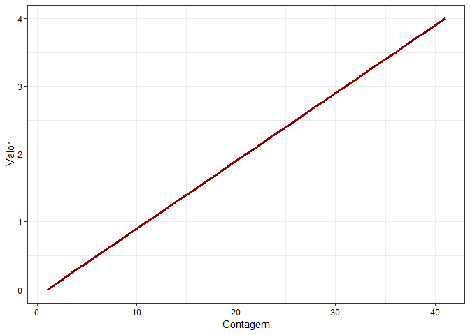
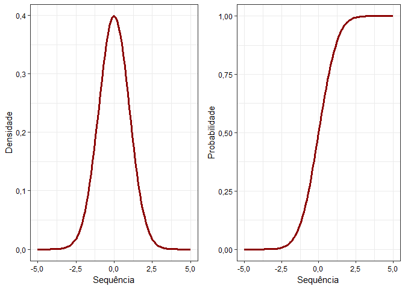
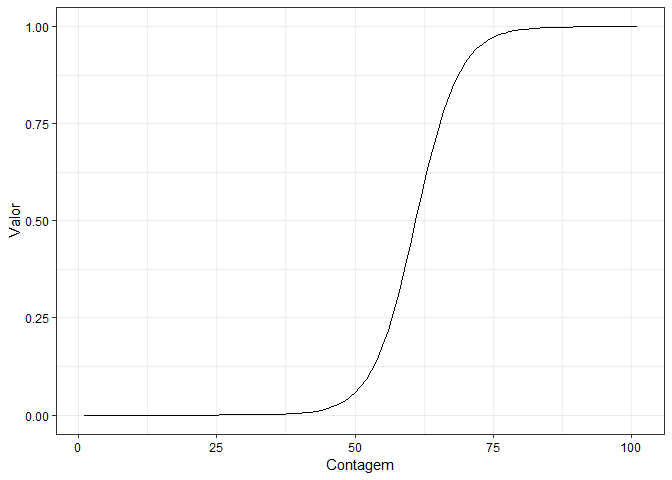
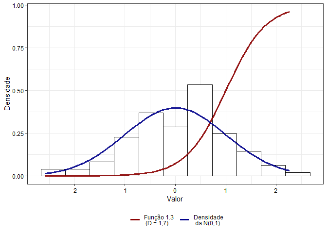
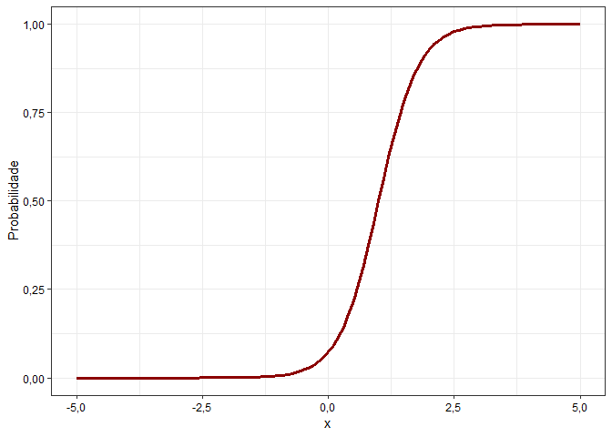
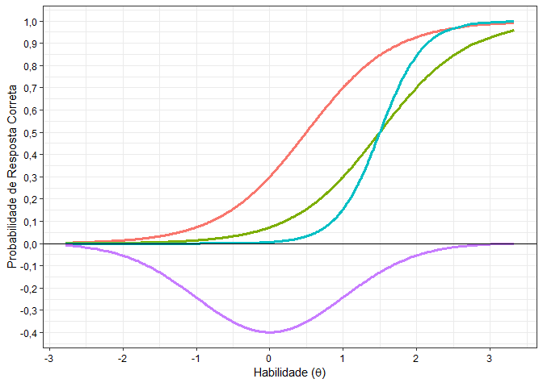
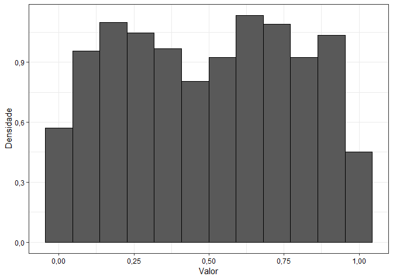

Limpando o banco
----------------

``` r
rm(list = ls())
```

Carregando o pacote tidyverse
-----------------------------

``` r
if(!require(tidyverse)) {
  install.packages("tidyverse", dependencies = T); 
  require(tidyverse)
}
```

    ## Loading required package: tidyverse

    ## Warning: package 'tidyverse' was built under R version 3.5.3

    ## -- Attaching packages --------------------------------- tidyverse 1.2.1 --

    ## v ggplot2 3.0.0     v purrr   0.2.5
    ## v tibble  1.4.2     v dplyr   0.7.7
    ## v tidyr   0.8.1     v stringr 1.3.1
    ## v readr   1.1.1     v forcats 0.3.0

    ## Warning: package 'ggplot2' was built under R version 3.5.1

    ## Warning: package 'dplyr' was built under R version 3.5.1

    ## -- Conflicts ------------------------------------ tidyverse_conflicts() --
    ## x dplyr::filter() masks stats::filter()
    ## x dplyr::lag()    masks stats::lag()

``` r
if(!require(knitr)) {
  install.packages("knitr", dependencies = T); 
  require(knitr)
}
```

    ## Loading required package: knitr

``` r
if(!require(rmarkdown)) {
  install.packages("rmarkdown", dependencies = T); 
  require(rmarkdown)
}
```

    ## Loading required package: rmarkdown

    ## Warning: package 'rmarkdown' was built under R version 3.5.1

Funções adicionais
------------------

``` r
formato_real <- function(values, nsmall = 0) { #- Formatando o valor como moeda brasileira
  values %>%
    as.numeric() %>%
    format(nsmall = nsmall, decimal.mark = ",", big.mark = ".") %>%
    str_trim() %>%
    str_c("R$ ", .)
}


formato_real_graf <- function(values, nsmall = 0) { #- Formatando o valor como moeda 
  values %>%
    as.numeric() %>%
    format(nsmall = nsmall, decimal.mark = ",", big.mark = ".") %>%
    str_trim()
}
```

Definindo o set.seed (semente)
------------------------------

``` r
set.seed(12345)
```

Questão 1
---------

### Questão 1.1

``` r
funcaoq11 <- function(x){
  
  valor <- x^2 - 5*x + 6
  
  return(valor)
  
}


seq(0, 4, 0.1) %>%
  as_tibble() %>%
  mutate(y = seq_along(map(.x = value, .f = funcaoq11))) %>% 
  ggplot() +
  geom_line(aes(x = y, y = value)) +
  theme_bw() +
  theme(legend.position = "bottom", 
        legend.direction = "horizontal",
        axis.title.y = element_text(colour = "black"),
        axis.title.x = element_text(colour = "black"),
        axis.text = element_text(colour = "black")) +
  labs(x = "Contagem", y = "Valor")
```



### Questão 1.2

``` r
rnorm(n = 100) %>% 
  as_tibble %>%
  ggplot(aes(x = value)) +
  geom_histogram(aes(y = ..density..),
                 colour = "black",
                 fill = "white",
                 bins = 11) +
  theme_bw() +
  stat_function(fun = dnorm, 
                args = list(mean = 0, sd = 1),
                color = "darkred",
                size = 0.7) +
  theme(legend.position = "bottom", 
        legend.direction = "horizontal",
        axis.title.y = element_text(colour = "black"),
        axis.title.x = element_text(colour = "black"),
        axis.text = element_text(colour = "black")) +
  labs(x = "Valor" , y = "Densidade")
```



### Questão 1.3 :: D = 1

``` r
funcaoq13 <- function(x, a, b, D){
  
  valor1 <- 1/(1 + exp(-D * a * (x - b)))
  
  return(valor1)
  
}


seq(-5, 5, 0.1) %>%
  map_dbl(~ funcaoq13(x = ., a = 1.5, b = 1, D = 1)) %>%
  as_tibble %>%
  mutate(cont = seq_along(value)) %>%
  ggplot() +
  geom_line(aes(x = cont, y = value)) +
  theme_bw() +
  theme(legend.position = "bottom", 
        legend.direction = "horizontal",
        axis.title.y = element_text(colour = "black"),
        axis.title.x = element_text(colour = "black"),
        axis.text = element_text(colour = "black")) +
  labs(x = "Contagem", y = "Valor")
```


### Questão 1.3 :: D = 1.7

``` r
seq(-5, 5, 0.1) %>%
  map_dbl(~ funcaoq13(x = ., a = 1.5, b = 1, D = 1.7)) %>%
  as_tibble %>%
  mutate(cont = seq_along(value)) %>%
  ggplot(data = .) +
  geom_line(aes(x = cont, y = value)) +
  theme_bw() +
  theme(legend.position = "bottom", 
        legend.direction = "horizontal",
        axis.title.y = element_text(colour = "black"),
        axis.title.x = element_text(colour = "black"),
        axis.text = element_text(colour = "black")) +
  labs(x = "Contagem", y = "Valor")
```



### Questão 1.4

``` r
rnorm(n = 100) %>% 
  as_tibble %>%
  ggplot(aes(x = value)) +
  theme_bw() +
  stat_function(fun = funcaoq13, 
                aes(colour = "bla"),
                args = list(a = 1.5, b = 1, D = 1.7),
                size = 1.2, 
                alpha = 0.9) + 
  stat_function(fun = dnorm, 
                aes(colour = "blabla"),
                size = 1.2,
                alpha = 0.9) + 
  scale_colour_manual(name = "", values = c("darkred", "darkblue"), 
                      breaks = c("bla", "blabla"), 
                      labels = c("Função 1.3 \n (D = 1,7)", "Densidade \n da N(0,1)")) + 
  theme(legend.position = "bottom", 
        legend.direction = "horizontal",
        axis.title.y = element_text(colour = "black"),
        axis.title.x = element_text(colour = "black"),
        axis.text = element_text(colour = "black")) +
  labs(x = "Valor", y = "Densidade")
```



### Questão 1.5

``` r
funcaoq15 <- function(x, a, b, c, D){
  
  valor3 <- (c + (1 - c))/(1 + exp(-D * a * (x - b)))
  
  return(valor3)
  
}


seq(-5, 5, 0.1) %>%
  map_dbl(~ funcaoq15(x = ., a = 1.5, b = 1, c = 0.2, D = 1.7)) %>%
  as_tibble %>%
  mutate(cont = seq_along(value)) %>%
  ggplot(data = .) +
  geom_line(aes(x = cont, y = value)) +
  theme_bw() +
  theme(legend.position = "bottom", 
        legend.direction = "horizontal",
        axis.title.y = element_text(colour = "black"),
        axis.title.x = element_text(colour = "black"),
        axis.text = element_text(colour = "black")) +
  labs(x = "Contagem", y = "Valor")
```



### Questão 1.6

``` r
rnorm(n = 1000) %>% 
  as_tibble %>% 
  mutate(curva1 = funcaoq15(x = value, a = 1, b = 0.5, c = 0.2, D = 1.7)) %>% 
  mutate(curva2 = funcaoq15(x = value, a = 1, b = 1.5, c = 0.2, D = 1.7)) %>% 
  mutate(curva3 = funcaoq15(x = value, a = 2, b = 1.5, c = 0.2, D = 1.7)) %>%
  mutate(norm_inv = -dnorm(x = value)) %>%
  ggplot(aes(x = value)) +
  geom_line(aes(y = curva1, colour = "bla1")) +
  geom_line(aes(y = curva2, colour = "bla2")) +
  geom_line(aes(y = curva3, colour = "bla3")) +
  geom_line(aes(y = norm_inv, colour = "bla4")) +
  scale_x_continuous(breaks = c(-3, -2, -1, 0, 1, 2, 3)) +
  scale_y_continuous(breaks = seq(-1, 1, 0.1), label = formato_real_graf) +
  theme_bw() +
  theme(legend.position = "none", 
        legend.direction = "horizontal",
        axis.title.y = element_text(colour = "black"),
        axis.title.x = element_text(colour = "black"),
        axis.text = element_text(colour = "black")) +
  labs(x = expression(paste("Habilidade ", "(", theta, ")")), 
       y = "Probabilidade de Resposta Correta") +
  geom_hline(yintercept = 0)
```



Questão 2
---------

### Questão 2.1

``` r
runif(n = 1000, min = 0, max = 1) %>%
  as_tibble() %>% 
  ggplot(aes(x = value)) +
  geom_histogram(aes(y = ..density..), 
                 colour = "black", 
                 bins = 12) +
  theme_bw() +
  theme(legend.position = "bottom", 
        legend.direction = "horizontal",
        axis.title.y = element_text(colour = "black"),
        axis.title.x = element_text(colour = "black"),
        axis.text = element_text(colour = "black")) +
  labs(x = "Valor", y = "Densidade")
```



### Questão 2.2

``` r
rbinom(n = 1000, size = 1, prob = 0.3) %>%
  as_tibble %>%
  summarise(media = mean(value), 
            variancia = var(value))
```

    ## # A tibble: 1 x 2
    ##   media variancia
    ##   <dbl>     <dbl>
    ## 1 0.301     0.211

### Questão 2.3

``` r
rbinom(n = 10, size = 1, prob = 0.5) %>%
  as_tibble %>%
  summarise(media = mean(value), 
            variancia = var(value))
```

    ## # A tibble: 1 x 2
    ##   media variancia
    ##   <dbl>     <dbl>
    ## 1   0.5     0.278

### Questão 2.4

``` r
rnorm(n = 1000) %>%
  as_tibble %>%
  summarise(media = mean(value), 
            variancia = var(value))
```

    ## # A tibble: 1 x 2
    ##     media variancia
    ##     <dbl>     <dbl>
    ## 1 -0.0342     0.916
