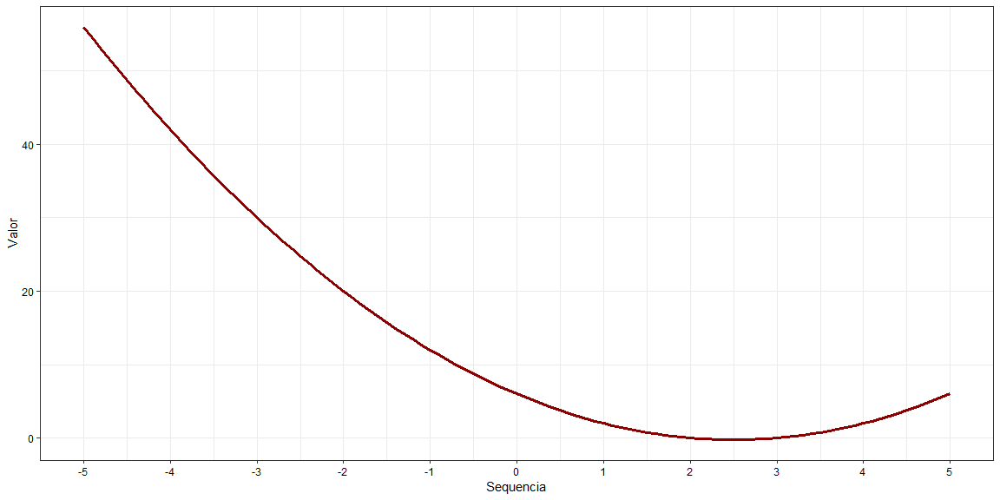
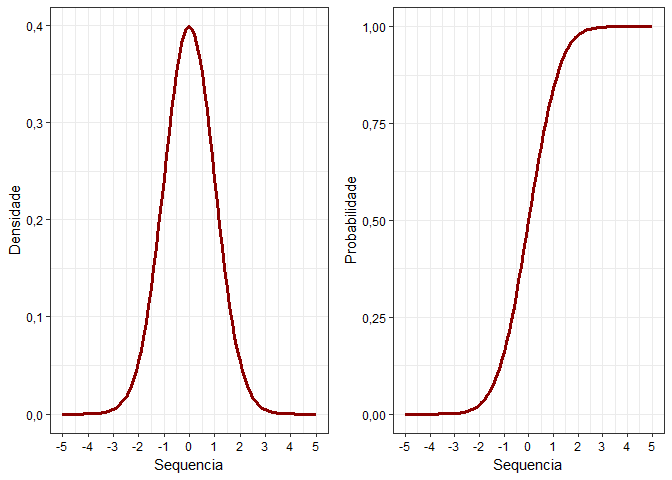
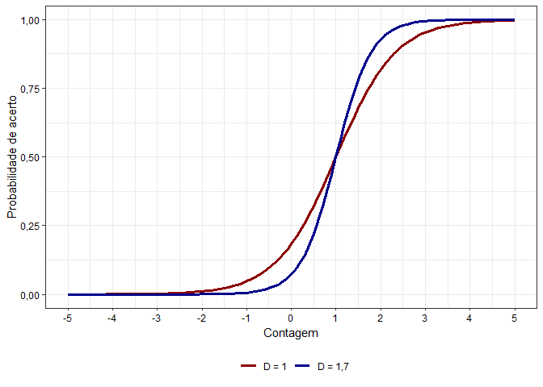
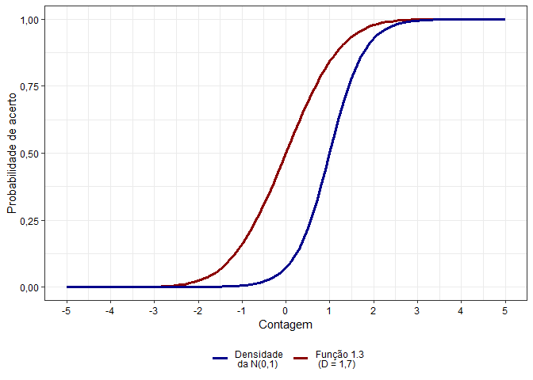
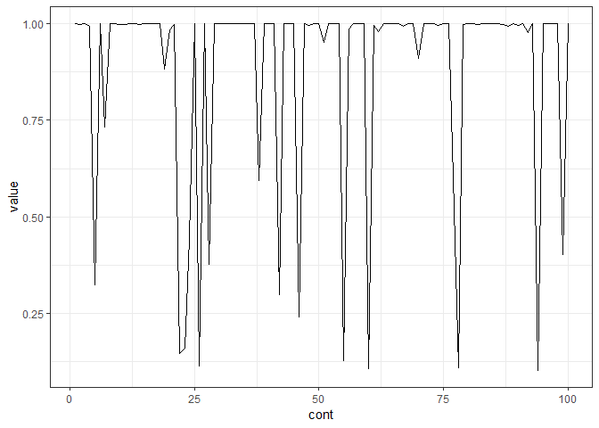
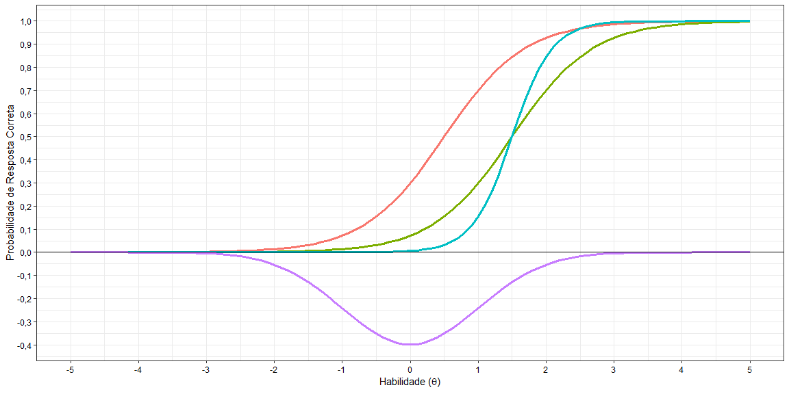

## Limpando o banco


```r
rm(list = ls())
```


## Carregando o pacote tidyverse


```r
if(!require(tidyverse)) {
  install.packages("tidyverse", dependencies = T); 
  require(tidyverse)
}
```

```
## Loading required package: tidyverse
```

```
## Warning: package 'tidyverse' was built under R version 3.5.3
```

```
## -- Attaching packages --------------------------------- tidyverse 1.2.1 --
```

```
## v ggplot2 3.0.0     v purrr   0.2.5
## v tibble  1.4.2     v dplyr   0.7.7
## v tidyr   0.8.1     v stringr 1.3.1
## v readr   1.1.1     v forcats 0.3.0
```

```
## Warning: package 'ggplot2' was built under R version 3.5.1
```

```
## Warning: package 'dplyr' was built under R version 3.5.1
```

```
## -- Conflicts ------------------------------------ tidyverse_conflicts() --
## x dplyr::filter() masks stats::filter()
## x dplyr::lag()    masks stats::lag()
```

```r
if(!require(ggpubr)) {
  install.packages("ggpubr", dependencies = T); 
  require(ggpubr)
}
```

```
## Loading required package: ggpubr
```

```
## Warning: package 'ggpubr' was built under R version 3.5.1
```

```
## Loading required package: magrittr
```

```
## 
## Attaching package: 'magrittr'
```

```
## The following object is masked from 'package:purrr':
## 
##     set_names
```

```
## The following object is masked from 'package:tidyr':
## 
##     extract
```

```r
if(!require(knitr)) {
  install.packages("knitr", dependencies = T); 
  require(knitr)
}
```

```
## Loading required package: knitr
```

```r
if(!require(rmarkdown)) {
  install.packages("rmarkdown", dependencies = T); 
  require(rmarkdown)
}
```

```
## Loading required package: rmarkdown
```

```
## Warning: package 'rmarkdown' was built under R version 3.5.1
```

```r
if(!require(kableExtra)) {
  install.packages("kableExtra", dependencies = T); 
  require(kableExtra)
}
```

```
## Loading required package: kableExtra
```

```
## Warning: package 'kableExtra' was built under R version 3.5.1
```

## Funções adicionais


```r
formato_real <- function(values, nsmall = 0) { #- Formatando o valor como moeda brasileira
  values %>%
    as.numeric() %>%
    format(nsmall = nsmall, decimal.mark = ",", big.mark = ".") %>%
    str_trim() %>%
    str_c("R$ ", .)
}


formato_real_graf <- function(values, nsmall = 0) { #- Formatando o valor como moeda 
  values %>%
    as.numeric() %>%
    format(nsmall = nsmall, decimal.mark = ",", big.mark = ".") %>%
    str_trim()
}
```


## Questão 1

### Questão 1.1


```r
funcaoq11 <- function(x){
  
  valor <- x^2 - 5*x + 6
  
  return(valor)
  
}


seq(-5, 5, 0.1) %>%
  as_tibble() %>%
  mutate(y = funcaoq11(x = value)) %>% 
  ggplot() +
  geom_line(aes(x = value, y = y), colour = "darkred", size = 1.2) +
  theme_bw() +
  theme(legend.position = "bottom", 
        legend.direction = "horizontal",
        axis.title.y = element_text(colour = "black"),
        axis.title.x = element_text(colour = "black"),
        axis.text = element_text(colour = "black")) +
  labs(x = "Sequência", y = "Valor") +
  scale_x_continuous(labels = formato_real_graf) +
  scale_y_continuous(labels = formato_real_graf)
```

<!-- -->


### Questão 1.2


```r
ggarrange(

seq(-5, 5, 0.1) %>% 
  as_tibble %>% 
  mutate(dist_normal = dnorm(value)) %>% 
  ggplot() +
  geom_line(aes(y = dist_normal, x = value), colour = "darkred", size = 1.2) +
  theme_bw() +
  theme(legend.position = "bottom", 
        legend.direction = "horizontal",
        axis.title.y = element_text(colour = "black"),
        axis.title.x = element_text(colour = "black"),
        axis.text = element_text(colour = "black")) +
  labs(x = "Sequência" , y = "Densidade") +
  scale_x_continuous(labels = formato_real_graf) +
  scale_y_continuous(labels = formato_real_graf)

,


seq(-5, 5, 0.1) %>% 
  as_tibble %>% 
  mutate(dist_normal1 = pnorm(value)) %>% 
  ggplot() +
  geom_line(aes(y = dist_normal1, x = value), colour = "darkred", size = 1.2) +
  theme_bw() +
  theme(legend.position = "bottom", 
        legend.direction = "horizontal",
        axis.title.y = element_text(colour = "black"),
        axis.title.x = element_text(colour = "black"),
        axis.text = element_text(colour = "black")) +
  labs(x = "Sequência" , y = "Probabilidade") +
  scale_x_continuous(labels = formato_real_graf) +
  scale_y_continuous(labels = formato_real_graf)


)
```

<!-- -->


### Questão 1.3


```r
funcaoq13 <- function(x, a, b, D){
  
  valor1 <- 1/(1 + exp(-D * a * (x - b)))
  
  return(valor1)
  
}


seq(-5, 5, 0.1) %>%
  as_tibble %>%
  mutate(D_1 = funcaoq13(x = value, a = 1.5, b = 1, D = 1)) %>% 
  mutate(D_1.7 = funcaoq13(x = value, a = 1.5, b = 1, D = 1.7)) %>% 
  ggplot() +
  geom_line(aes(x = value, y = D_1, colour = "D = 1"), size = 1.2) +
  geom_line(aes(x = value, y = D_1.7, colour = "D = 1,7"), size = 1.2) +
  theme_bw() +
  theme(legend.position = "bottom", 
        legend.direction = "horizontal",
        axis.title.y = element_text(colour = "black"),
        axis.title.x = element_text(colour = "black"),
        axis.text = element_text(colour = "black")) +
  labs(x = "Contagem", y = "Probabilidade de acerto") +
  scale_colour_manual(name = "",
                      guide = "legend", 
                      values = c("darkred", "darkblue")) +
  scale_x_continuous(labels = formato_real_graf) +
  scale_y_continuous(labels = formato_real_graf)
```

<!-- -->


### Questão 1.4


```r
seq(-5, 5, 0.1) %>% 
  as_tibble %>% 
  mutate(dist_normal1 = pnorm(value)) %>% 
  mutate(D_1.7 = funcaoq13(x = value, a = 1.5, b = 1, D = 1.7)) %>% 
  ggplot() +
  geom_line(aes(x = value, y = dist_normal1, colour = "Densidade"), size = 1.2) +
  geom_line(aes(x = value, y = D_1.7, colour = "D = 1,7"), size = 1.2) +
  theme_bw() +
  theme(legend.position = "bottom", 
        legend.direction = "horizontal",
        axis.title.y = element_text(colour = "black"),
        axis.title.x = element_text(colour = "black"),
        axis.text = element_text(colour = "black")) +
  labs(x = "Contagem", y = "Probabilidade de acerto") +
  scale_colour_manual(name = "", values = c("darkblue", "darkred"),
                      labels = c("Densidade \n da N(0,1)", "Função 1.3 \n (D = 1,7)")) +
  scale_x_continuous(labels = formato_real_graf) +
  scale_y_continuous(labels = formato_real_graf)
```

<!-- -->


### Questão 1.5


```r
funcaoq15 <- function(x, a, b, c, D){
  
  valor3 <- (c + (1 - c))/(1 + exp(-D * a * (x - b)))
  
  return(valor3)
  
}


seq(-5, 5, 0.1) %>%
  as_tibble %>% 
  mutate(q15 = funcaoq15(x = value, a = 1.5, b = 1, c = 0.2, 
                         D = 1.7)) %>% 
  ggplot() +
  geom_line(aes(x = value, y = q15), color = "darkred", size = 1.2) +
  theme_bw() +
  theme(legend.position = "bottom", 
        legend.direction = "horizontal",
        axis.title.y = element_text(colour = "black"),
        axis.title.x = element_text(colour = "black"),
        axis.text = element_text(colour = "black")) +
  labs(x = "x", y = "Probabilidade") +
  scale_x_continuous(labels = formato_real_graf) +
  scale_y_continuous(labels = formato_real_graf)
```

<!-- -->


### Questão 1.6


```r
seq(-5, 5, 0.1) %>% 
  as_tibble %>% 
  mutate(curva1 = funcaoq15(x = value, a = 1, b = 0.5, c = 0.2, 
                            D = 1.7)) %>% 
  mutate(curva2 = funcaoq15(x = value, a = 1, b = 1.5, c = 0.2, 
                            D = 1.7)) %>% 
  mutate(curva3 = funcaoq15(x = value, a = 2, b = 1.5, c = 0.2, 
                            D = 1.7)) %>%
  mutate(norm_inv = -dnorm(x = value)) %>%
  ggplot(aes(x = value)) +
  geom_line(aes(y = curva1, colour = "bla1"), size = 1.2) +
  geom_line(aes(y = curva2, colour = "bla2"), size = 1.2) +
  geom_line(aes(y = curva3, colour = "bla3"), size = 1.2) +
  geom_line(aes(y = norm_inv, colour = "bla4"), size = 1.2) +
  scale_x_continuous(breaks = -5:5) +
  scale_y_continuous(breaks = seq(-1, 1, 0.1), label = formato_real_graf) +
  theme_bw() +
  theme(legend.position = "none", 
        legend.direction = "horizontal",
        axis.title.y = element_text(colour = "black"),
        axis.title.x = element_text(colour = "black"),
        axis.text = element_text(colour = "black")) +
  labs(x = expression(paste("Habilidade ", "(", theta, ")")), 
       y = "Probabilidade de Resposta Correta") +
  geom_hline(yintercept = 0)
```

<!-- -->


## Questão 2


### Questão 2.1


```r
runif(n = 1000, min = 0, max = 1) %>%
  as_tibble() %>% 
  ggplot(aes(x = value)) +
  geom_histogram(aes(y = ..density..), 
                 colour = "black", 
                 bins = 12) +
  theme_bw() +
  theme(legend.position = "bottom", 
        legend.direction = "horizontal",
        axis.title.y = element_text(colour = "black"),
        axis.title.x = element_text(colour = "black"),
        axis.text = element_text(colour = "black")) +
  labs(x = "Valor", y = "Densidade")
```

<!-- -->


### Questão 2.2


```r
rbinom(n = 1000, size = 1, prob = 0.3) %>%
  as_tibble %>%
  summarise(media = mean(value), 
            variancia = var(value))
```

```
## # A tibble: 1 x 2
##   media variancia
##   <dbl>     <dbl>
## 1 0.298     0.209
```


### Questão 2.3


```r
rbinom(n = 10, size = 1, prob = 0.5) %>%
  as_tibble %>%
  summarise(media = mean(value), 
            variancia = var(value)) %>% 
  set_colnames(c("Média", "Variância")) %>%
  kable(align = "c") %>% 
  kable_styling(bootstrap_options = "striped", full_width = F, position = "center") %>% 
  row_spec(0, bold = T, color = "black", background = "white") %>% 
  row_spec(1, color = "black", background = "white")
```

<table class="table table-striped" style="width: auto !important; margin-left: auto; margin-right: auto;">
 <thead>
  <tr>
   <th style="text-align:center;font-weight: bold;color: black;background-color: white;"> Média </th>
   <th style="text-align:center;font-weight: bold;color: black;background-color: white;"> Variância </th>
  </tr>
 </thead>
<tbody>
  <tr>
   <td style="text-align:center;color: black;background-color: white;"> 0.4 </td>
   <td style="text-align:center;color: black;background-color: white;"> 0.2666667 </td>
  </tr>
</tbody>
</table>


### Questão 2.4


```r
rnorm(n = 1000) %>%
  as_tibble %>%
  summarise(media = mean(value), 
            variancia = var(value)) %>% 
  set_colnames(c("Média", "Probabilidade")) %>%
  kable(align = "c") %>% 
  kable_styling(bootstrap_options = "striped", full_width = F, position = "center") %>% 
  row_spec(0, bold = T, color = "black", background = "white") %>% 
  row_spec(1, color = "black", background = "white")
```

<table class="table table-striped" style="width: auto !important; margin-left: auto; margin-right: auto;">
 <thead>
  <tr>
   <th style="text-align:center;font-weight: bold;color: black;background-color: white;"> Média </th>
   <th style="text-align:center;font-weight: bold;color: black;background-color: white;"> Probabilidade </th>
  </tr>
 </thead>
<tbody>
  <tr>
   <td style="text-align:center;color: black;background-color: white;"> 0.0120481 </td>
   <td style="text-align:center;color: black;background-color: white;"> 0.9838306 </td>
  </tr>
</tbody>
</table>


## Questão 3


### Questão 3.1


```r
rnorm(n = 1000) %>% 
  as_tibble %>% 
  xlsx::write.xlsx(file = "Tarefa_3.1.xlsx", sheetName = "BD")
```


### Questão 3.2


```r
rnorm(n = 1000, mean = 0, sd = 1) %>% 
  as_tibble %>%
  mutate(probabilidade = funcaoq15(x = value, a = 1.5, 
                                   b = 1, c = 0.2, D = 1.7)) %>% 
  mutate(prob_porc = paste(formato_real_graf(values = round(x = probabilidade, digits = 2), nsmall = 2), "%", sep = "")) %>% 
  head(6) %>% 
  set_colnames(c("Valor", "Probabilidade", "Probabilidade (em %)")) %>%
  kable(align = "c") %>% 
  kable_styling(bootstrap_options = "striped", full_width = F, position = "center") %>% 
  row_spec(0, bold = T, color = "black", background = "white") %>% 
  row_spec(1:6, color = "black", background = "white")
```

<table class="table table-striped" style="width: auto !important; margin-left: auto; margin-right: auto;">
 <thead>
  <tr>
   <th style="text-align:center;font-weight: bold;color: black;background-color: white;"> Valor </th>
   <th style="text-align:center;font-weight: bold;color: black;background-color: white;"> Probabilidade </th>
   <th style="text-align:center;font-weight: bold;color: black;background-color: white;"> Probabilidade (em %) </th>
  </tr>
 </thead>
<tbody>
  <tr>
   <td style="text-align:center;color: black;background-color: white;"> -1.1887258 </td>
   <td style="text-align:center;color: black;background-color: white;"> 0.0037537 </td>
   <td style="text-align:center;color: black;background-color: white;"> 0,00% </td>
  </tr>
  <tr>
   <td style="text-align:center;color: black;background-color: white;"> 0.4311760 </td>
   <td style="text-align:center;color: black;background-color: white;"> 0.1899244 </td>
   <td style="text-align:center;color: black;background-color: white;"> 0,19% </td>
  </tr>
  <tr>
   <td style="text-align:center;color: black;background-color: white;"> 2.0171783 </td>
   <td style="text-align:center;color: black;background-color: white;"> 0.9304618 </td>
   <td style="text-align:center;color: black;background-color: white;"> 0,93% </td>
  </tr>
  <tr>
   <td style="text-align:center;color: black;background-color: white;"> -0.2361640 </td>
   <td style="text-align:center;color: black;background-color: white;"> 0.0410040 </td>
   <td style="text-align:center;color: black;background-color: white;"> 0,04% </td>
  </tr>
  <tr>
   <td style="text-align:center;color: black;background-color: white;"> -0.0467345 </td>
   <td style="text-align:center;color: black;background-color: white;"> 0.0648171 </td>
   <td style="text-align:center;color: black;background-color: white;"> 0,06% </td>
  </tr>
  <tr>
   <td style="text-align:center;color: black;background-color: white;"> 1.1779550 </td>
   <td style="text-align:center;color: black;background-color: white;"> 0.6115388 </td>
   <td style="text-align:center;color: black;background-color: white;"> 0,61% </td>
  </tr>
</tbody>
</table>


### Questão 3.3


```r
set.seed(1234)


q33 <- 
  rnorm(n = 1000, mean = 0, sd = 1) %>% 
  as_tibble %>%
  mutate(probabilidade = funcaoq15(x = value, 
                                   a = 1.5, b = 1, c = 0.2, 
                                   D = 1.7)) %>%
  mutate(bernoulli = rbinom(n = 1000, size = 1, prob = probabilidade))


q33 %>% 
  set_colnames(c("Valor", "Probabilidade", "Bernoulli")) %>%
  head(10) %>% 
  kable(align = "c") %>% 
  kable_styling(bootstrap_options = "striped", full_width = F, position = "center") %>% 
  row_spec(0, bold = T, color = "black", background = "white") %>% 
  row_spec(1:10, color = "black", background = "white")
```

<table class="table table-striped" style="width: auto !important; margin-left: auto; margin-right: auto;">
 <thead>
  <tr>
   <th style="text-align:center;font-weight: bold;color: black;background-color: white;"> Valor </th>
   <th style="text-align:center;font-weight: bold;color: black;background-color: white;"> Probabilidade </th>
   <th style="text-align:center;font-weight: bold;color: black;background-color: white;"> Bernoulli </th>
  </tr>
 </thead>
<tbody>
  <tr>
   <td style="text-align:center;color: black;background-color: white;"> -1.2070657 </td>
   <td style="text-align:center;color: black;background-color: white;"> 0.0035828 </td>
   <td style="text-align:center;color: black;background-color: white;"> 0 </td>
  </tr>
  <tr>
   <td style="text-align:center;color: black;background-color: white;"> 0.2774292 </td>
   <td style="text-align:center;color: black;background-color: white;"> 0.1367493 </td>
   <td style="text-align:center;color: black;background-color: white;"> 0 </td>
  </tr>
  <tr>
   <td style="text-align:center;color: black;background-color: white;"> 1.0844412 </td>
   <td style="text-align:center;color: black;background-color: white;"> 0.5536242 </td>
   <td style="text-align:center;color: black;background-color: white;"> 0 </td>
  </tr>
  <tr>
   <td style="text-align:center;color: black;background-color: white;"> -2.3456977 </td>
   <td style="text-align:center;color: black;background-color: white;"> 0.0001971 </td>
   <td style="text-align:center;color: black;background-color: white;"> 0 </td>
  </tr>
  <tr>
   <td style="text-align:center;color: black;background-color: white;"> 0.4291247 </td>
   <td style="text-align:center;color: black;background-color: white;"> 0.1891210 </td>
   <td style="text-align:center;color: black;background-color: white;"> 0 </td>
  </tr>
  <tr>
   <td style="text-align:center;color: black;background-color: white;"> 0.5060559 </td>
   <td style="text-align:center;color: black;background-color: white;"> 0.2210501 </td>
   <td style="text-align:center;color: black;background-color: white;"> 0 </td>
  </tr>
  <tr>
   <td style="text-align:center;color: black;background-color: white;"> -0.5747400 </td>
   <td style="text-align:center;color: black;background-color: white;"> 0.0177130 </td>
   <td style="text-align:center;color: black;background-color: white;"> 0 </td>
  </tr>
  <tr>
   <td style="text-align:center;color: black;background-color: white;"> -0.5466319 </td>
   <td style="text-align:center;color: black;background-color: white;"> 0.0190041 </td>
   <td style="text-align:center;color: black;background-color: white;"> 0 </td>
  </tr>
  <tr>
   <td style="text-align:center;color: black;background-color: white;"> -0.5644520 </td>
   <td style="text-align:center;color: black;background-color: white;"> 0.0181752 </td>
   <td style="text-align:center;color: black;background-color: white;"> 0 </td>
  </tr>
  <tr>
   <td style="text-align:center;color: black;background-color: white;"> -0.8900378 </td>
   <td style="text-align:center;color: black;background-color: white;"> 0.0080054 </td>
   <td style="text-align:center;color: black;background-color: white;"> 0 </td>
  </tr>
</tbody>
</table>


Para confirmar que não há somente zeros na coluna bernoulli, temos


```r
q33 %>% 
  summarise(media_bern = mean(bernoulli), var_bern = var(bernoulli)) %>% 
  mutate_all(funs(formato_real_graf(round(., digits = 4), nsmall = 4))) %>%
    set_colnames(c("Média da Bernoulli", "Variância da Bernoulli")) %>% 
  kable(align = "c") %>% 
  kable_styling(bootstrap_options = "striped", full_width = F, position = "center") %>% 
  row_spec(0, bold = T, color = "black", background = "white") %>% 
  row_spec(1, color = "black", background = "#white")
```

<table class="table table-striped" style="width: auto !important; margin-left: auto; margin-right: auto;">
 <thead>
  <tr>
   <th style="text-align:center;font-weight: bold;color: black;background-color: white;"> Média da Bernoulli </th>
   <th style="text-align:center;font-weight: bold;color: black;background-color: white;"> Variância da Bernoulli </th>
  </tr>
 </thead>
<tbody>
  <tr>
   <td style="text-align:center;color: black;background-color: #white;"> 0,2030 </td>
   <td style="text-align:center;color: black;background-color: #white;"> 0,1620 </td>
  </tr>
</tbody>
</table>


