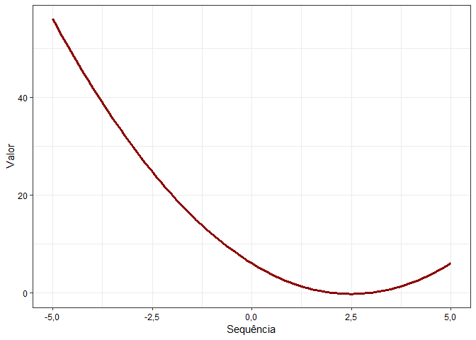

Limpando o banco
----------------

    rm(list = ls())

Carregando o pacote tidyverse
-----------------------------

    if(!require(tidyverse)) {
      install.packages("tidyverse", dependencies = T); 
      require(tidyverse)
    }

    ## Loading required package: tidyverse

    ## -- Attaching packages ------------------------------ tidyverse 1.2.1 --

    ## v ggplot2 3.1.0     v purrr   0.3.0
    ## v tibble  2.0.1     v dplyr   0.7.8
    ## v tidyr   0.8.2     v stringr 1.4.0
    ## v readr   1.3.1     v forcats 0.3.0

    ## -- Conflicts --------------------------------- tidyverse_conflicts() --
    ## x dplyr::filter() masks stats::filter()
    ## x dplyr::lag()    masks stats::lag()

    if(!require(knitr)) {
      install.packages("knitr", dependencies = T); 
      require(knitr)
    }

    ## Loading required package: knitr

    if(!require(rmarkdown)) {
      install.packages("rmarkdown", dependencies = T); 
      require(rmarkdown)
    }

    ## Loading required package: rmarkdown

Definindo o set.seed (semente)
------------------------------

    set.seed(12345)

Questão 1
---------

### Questão 1.1

    funcaoq11 <- function(x){
      
      valor <- x^2 - 5*x + 6
      
      return(valor)
      
    }

    runif(n = 100, min = 0, max = 4) %>%
      as_tibble() %>%
      mutate(y = seq_along(map(.x = value, .f = funcaoq11))) %>% 
      ggplot() +
      geom_line(aes(x = y, y = value)) +
      theme_bw()

